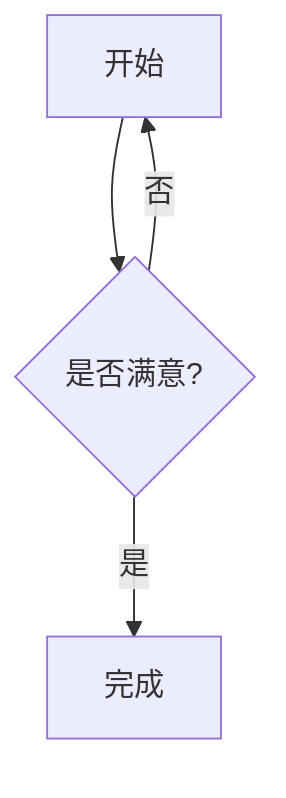

# 发布文章

所有文章都存放在 **`src/content/posts/`** 目录，每篇是一个 Markdown 文件（`.md` 或 `.mdx`）。文件名就是文章链接的一部分：`/posts/<文件名>/`。

## 1. 快速创建新文章

推荐用脚本生成带 Frontmatter 模板的文件：

```powershell
pnpm new-post 我的第一篇文章
```

执行后在 `src/content/posts/我的第一篇文章.md` 生成以下内容：

```markdown
---
title: 我的第一篇文章
published: 2026-08-11
description: ''
image: ''
tags: []
category: ''
draft: false
lang: ''
---
```

> [!TIP]
> - 文件名可含路径（如 `pnpm new-post python/教程一`），会创建子目录。
> - 脚本自动补 `.md` 后缀；文件已存在时会报错。
> - 也可以直接手动在 `src/content/posts/` 新建 `.md` 文件，不依赖脚本。

## 2. Frontmatter 字段说明

Frontmatter 是文章开头的 `---` 与 `---` 之间的 YAML 配置，决定了文章如何展示。

| 字段 | 必填 | 类型 | 说明 |
| --- | --- | --- | --- |
| `title` | ✅ | string | 文章标题 |
| `published` | ✅ | date | 发布日期，格式 `YYYY-MM-DD`，用于排序 |
| `updated` | ❌ | date | 更新日期，会显示"上次编辑"卡片 |
| `description` | ❌ | string | 摘要 / SEO 描述，留空则取正文前几字 |
| `image` | ❌ | string | 封面图。可填路径（`./xxx.jpg`）或 `"api"` 启用随机封面图 |
| `tags` | ❌ | array | 标签列表，如 `[Python, 教程]` |
| `category` | ❌ | string | 分类 |
| `draft` | ❌ | boolean | `true` 为草稿：**本地开发可见，正式构建时隐藏** |
| `pinned` | ❌ | boolean | `true` 置顶（排在最前，置顶文章间按日期排序） |
| `lang` | ❌ | string | 仅当文章语言与站点语言不同时设置（如 `en`） |
| `author` | ❌ | string | 作者（用于许可证卡片） |
| `sourceLink` | ❌ | string | 原文链接（转载类文章用） |
| `licenseName` / `licenseUrl` | ❌ | string | 自定义许可证名称与链接 |

### 示例

```markdown
---
title: 使用 uv 管理 Python 项目
published: 2026-08-01
updated: 2026-08-05
description: 一篇介绍 uv 基础用法的教程
image: ./uv-cover.png
tags: [Python, 教程]
category: 技术
pinned: true
draft: false
---
```

> [!NOTE]
> 置顶与排序逻辑在 `src/utils/content-utils.ts`：先按 `pinned` 置顶，再按 `published` 倒序。
> 草稿仅在 `pnpm build`（生产）时被过滤，本地 `pnpm dev` 仍会显示。

## 3. Markdown 扩展语法

除标准 Markdown 外，本博客支持以下增强功能（见 `src/content/posts/markdown-extended.md`、`markdown-mermaid.md` 等示例文章）。

### 3.1 提醒框（Admonition）

五类提醒框：`note`、`tip`、`important`、`warning`、`caution`。

```markdown
:::note
注意内容
:::

:::tip
提示内容
:::
```

也支持 GitHub 风格语法：

```markdown
> [!TIP]
> 提示内容
```

自定义标题：

```markdown
:::note[我的自定义标题]
内容
:::
```

### 3.2 GitHub 仓库卡片

```markdown
::github{repo="lnxlnxlnx/my-blog"}
```

会从 GitHub API 拉取仓库信息并渲染卡片。

### 3.3 剧透文本

```markdown
内容 :spoiler[被隐藏的 **文本**]！
```

### 3.4 数学公式（KaTeX）

```markdown
行内公式：$E=mc^2$

块级公式：
$$
\int_0^\infty e^{-x^2} dx = \frac{\sqrt{\pi}}{2}
$$
```

### 3.5 Mermaid 流程图

在代码块中使用 `mermaid` 语言：

```markdown

```

### 3.6 代码块增强（Expressive Code）

```markdown
```js 第3行高亮 / 折叠  // 标题栏：js 语言、行号、折叠按钮、自定义标题
// 代码内容
const a = 1
```
```

- 语言标识显示在标题栏（可通过 `src/config/expressiveCodeConfig.ts` 调整主题）
- 支持行号（`/ 显示行号`）、代码折叠（`/ 折叠`）、一键复制按钮
- 配置在 `astro.config.mjs` 的 `expressiveCode` 与 `src/config/expressiveCodeConfig.ts`

### 3.7 嵌入视频

直接粘贴 iframe 代码即可（YouTube / Bilibili）：

```html
<iframe width="100%" height="468" src="//player.bilibili.com/player.html?bvid=BV1fK4y1s7Qf&autoplay=0"></iframe>
```

### 3.8 图片与灯箱

- 文章内图片默认支持 Fancybox 灯箱放大预览
- 封面图：Frontmatter 中 `image` 填图片路径；填 `"api"` 则从 `src/config/coverImageConfig.ts` 配置的随机图 API 获取（需先 `enable: true`）
- 图片建议放在文章同级目录并用相对路径引用（如 `./img.png`），便于 RSS 与构建优化

## 4. 页面的"关于 / 友链 / 留言板"内容

- **关于页**：`src/content/spec/about.md`
- **友情链接页**：`src/content/spec/friends.md`（申请规则文案）+ `src/config/friendsConfig.ts`（友链数据）
- **留言板页**：`src/content/spec/guestbook.md`

这些不是普通文章，编辑对应 `.md` 文件即可改页面内容。

## 5. 发布流程

1. 写好文章，`pnpm dev` 本地预览确认
2. `pnpm check` 通过类型检查
3. `git add . && git commit && git push`
4. GitHub Actions 自动构建并部署

> [!WARNING]
> 发布前检查 Frontmatter 的 `draft`：`true` 的草稿在正式站点不显示。确认无误后改为 `false` 或删除该字段。
