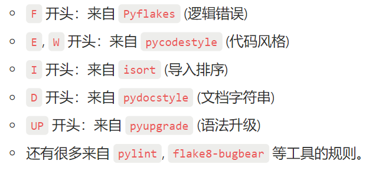

# ruff功能一览:

| 任务 | 命令 |
| --- | --- |
| **格式化我的代码** | `ruff format .` |
| **检查代码问题并自动修复** | `ruff check . --fix` |
| **在 CI/CD 中验证格式** | `ruff format . --check` |
| **在 CI/CD 中检查代码质量** | `ruff check .` |
| **开发时实时检查** | `ruff check . --watch` |
| **搞不清某条规则是什么意思** | `ruff rule <RULE_CODE>` |
| **清理缓存** | `ruff cache clean` |
| **终极清理** | `ruff format . && ruff check . --fix` |