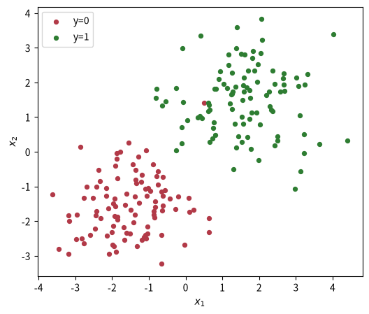
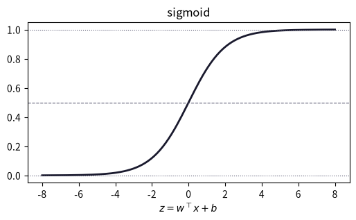
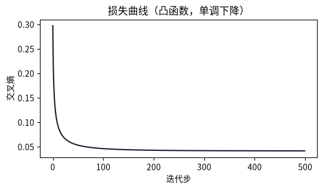
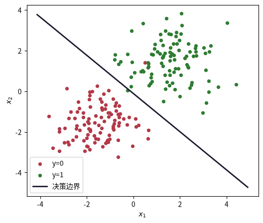
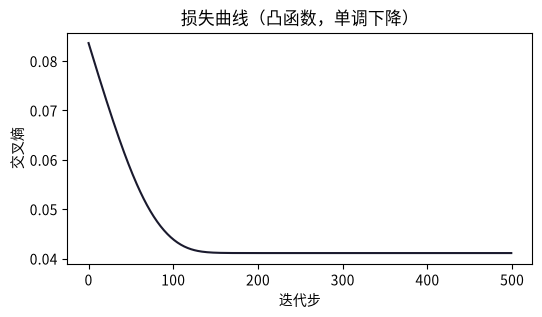
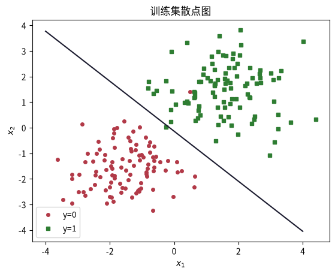
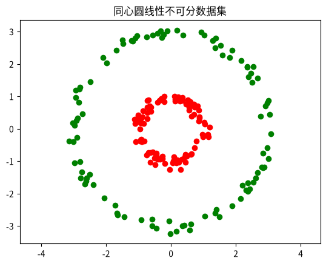
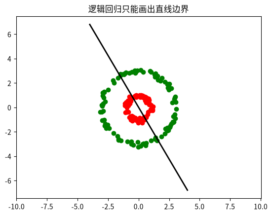

# 逻辑回归：把线性模型搬到分类

这是机器学习系列课程笔记的第 4 课（前置：课程 0003 线性回归三件套）。上一课把「模型 / 策略 / 算法」三件套在回归上走了一遍，本课把它搬到**分类**：逻辑回归。你会发现它几乎是线性回归的「小改版」，却解决的是完全不同的问题——而且它就是你学过的神经网络最基础的一块砖。

回顾三要素（李航）：**模型**是候选函数集合，**策略**是判断好坏的标准（损失函数），**算法**是怎么搜（求解方法）。每实现一步都问自己：我现在填的是三要素里的哪一格？

---

## 一、知识点

### 问题：回归不能直接做分类

分类要输出「P(y=1|x)」——一个 0 到 1 之间的概率。而线性回归的输出是整个实数轴：可能 `ŷ = -3` 或 `ŷ = 7`，没法当概率用。所以需要在线性函数外面加一层「压缩器」。

### 三要素之「模型」：sigmoid

$$\hat{y} = \sigma(w^Tx + b) = \frac{1}{1 + e^{-(w^Tx + b)}}$$

- sigmoid 把任意实数压到 (0,1)，可解释为概率：越接近 0 → 类 0，越接近 1 → 类 1。
- 分界在 ŷ = 0.5，即 $w^Tx + b = 0$ —— **永远是一条直线（超平面）**。
- **模型** = 所有形如 σ(wᵀx+b) 的函数集合。

### 三要素之「策略」：极大似然 → 交叉熵

把 ŷ 当正类概率，对每个样本写出似然，取负对数，得到交叉熵（对数损失）：

$$L(w) = -\frac{1}{N}\sum_{i} \left[ y_i \log\hat{y}_i + (1-y_i)\log(1-\hat{y}_i) \right]$$

两个关键点：

- **为什么不用均方误差？** sigmoid + MSE 是非凸的，梯度下降会卡在局部极小；而 **sigmoid + 交叉熵是凸的**，保证收敛到全局最优。这是「策略」选择背后的数学。
- 完全猜对时 L=0；全给 0.5 时 L = ln 2 ≈ 0.693（notebook 第一步会验证到这个值）。

### 三要素之「算法」：梯度下降，且梯度出奇地简单

$$\nabla L(w) = \frac{1}{N}X^T(\hat{y} - y)$$

这个梯度和线性回归的梯度**长得几乎一样**（都形如「残差 × 特征」的平均）。同一个「算法」（梯度下降）服务两个不同的「模型」——上一课说的「三要素可自由组合」的又一例证。

### 推荐阅读

- **李航《统计学习方法》§6.1 逻辑斯谛回归** —— 模型的来历（从条件概率分布导出）、极大似然估计推导、梯度公式。[豆瓣页面](https://book.douban.com/subject/33437381/)。
- **ISL 第 4 章（Classification）** —— 为什么线性回归不适合分类、逻辑回归在真实数据上的表现。[statlearning.com 免费下载](https://www.statlearning.com/)。
- Andrew Ng 课程 1 第 3 周：逻辑回归与梯度下降的逐步推导，可免费旁听。[Coursera](https://www.coursera.org/specializations/machine-learning-introduction)。

---

## 二、动手实践

### 构造二分类数据集

用两个稍微重叠的高斯团生成数据：类 0 在左下、类 1 在右上，每个样本 2 个特征，标签 `y ∈ {0,1}`。

```python
import numpy as np
import matplotlib.pyplot as plt

rng = np.random.default_rng(42)
N = 200
X0 = rng.normal(loc=[-1.5, -1.5], scale=1.0, size=(N // 2, 2))
X1 = rng.normal(loc=[1.5, 1.5], scale=1.0, size=(N - N // 2, 2))
X = np.vstack([X0, X1])
y = np.concatenate([np.zeros(N // 2), np.ones(N - N // 2)])

plt.figure(figsize=(6, 5))
plt.scatter(X[y == 0, 0], X[y == 0, 1], c="#b23a48", s=18, label="y=0")
plt.scatter(X[y == 1, 0], X[y == 1, 1], c="#2e7d32", s=18, label="y=1")
plt.xlabel("$x_1$"); plt.ylabel("$x_2$"); plt.legend(); plt.show()
```

两个高斯簇构成的人工二分类数据集，用于测试逻辑回归、SVM、聚类等分类算法。



### sigmoid：数值稳定版

z 很小时 `exp` 会溢出，先 clip 到 [-30, 30] 再算。

```python
def sigmoid(z: np.ndarray) -> np.ndarray:
    return 1.0 / (1.0 + np.exp(-np.clip(z, -30, 30)))

z = np.linspace(-8, 8, 200)
plt.figure(figsize=(6, 3))
plt.plot(z, sigmoid(z), color="#1a1a2e", linewidth=2)
plt.axhline(0.5, ls="--", color="#5c5c75", lw=0.8)
plt.axhline(0, ls=":", color="#5c5c75", lw=0.8)
plt.axhline(1, ls=":", color="#5c5c75", lw=0.8)
plt.title("sigmoid"); plt.xlabel("$z = w^\\top x + b$"); plt.show()
```

sigmoid 把任意实数压到 (0,1)，0.5 为分界线，越接近边界越「确定」。



一句话：回归管「值」，分类管「概率」。逻辑回归 = 线性函数 + sigmoid + 交叉熵。

### 交叉熵损失（log loss）

```python
def log_loss(w: np.ndarray, Xb: np.ndarray, y: np.ndarray) -> float:
    yhat = sigmoid(Xb @ w)
    return float(-np.mean(y * np.log(yhat + 1e-12) + (1 - y) * np.log(1 - yhat + 1e-12)))

Xb = np.hstack([X, np.ones((N, 1))])   # 模型：ŷ = σ(Xb @ w)，w 最后一维是 b
w0 = np.zeros(len(Xb[0]))              # 初始权重全为 0，预测概率全为 0.5
print("初始损失（全部概率=0.5）：", round(log_loss(w0, Xb, y), 4), "（应为约 0.693 = ln 2）")
```

初始权重全为 0 时预测概率全为 0.5，损失应为 ln 2 ≈ 0.693，代码会验证到这个值。实现里加 `1e-12` 防止 `log(0)`。

### 梯度下降训练

梯度公式正是 $\frac{1}{N}X^T(\hat{y} - y)$，和线性回归的梯度长得一模一样——都是「残差 × 特征」的平均。

```python
def train_logistic(Xb: np.ndarray, y: np.ndarray, lr: float = 0.5, steps: int = 500):
    w = np.zeros(Xb.shape[1])
    losses = []
    for _ in range(steps):
        yhat = sigmoid(Xb @ w)
        grad = (Xb.T @ (yhat - y)) / Xb.shape[0]
        w -= lr * grad
        losses.append(log_loss(w, Xb, y))
    return w, losses

w_hat, losses = train_logistic(Xb, y)

plt.figure(figsize=(6, 3))
plt.plot(losses, color="#1a1a2e", linewidth=1.5)
plt.xlabel("迭代步"); plt.ylabel("交叉熵"); plt.title("损失曲线（凸函数，单调下降）"); plt.show()
print("w =", np.round(w_hat, 3))

acc = float(np.mean((sigmoid(Xb @ w_hat) > 0.5) == y))
print("训练集准确率：", round(acc, 3))
```

因为是凸函数，损失曲线单调下降，最后输出训练出的 w 与训练集准确率。



### 决策边界：一条直线

边界方程 w·x + b = 0 是一条直线，把训练出的 w 代回去画出来。

```python
w1, w2, b = w_hat
x1 = np.linspace(X[:, 0].min() - 0.5, X[:, 0].max() + 0.5, 200)
x2 = -(w1 * x1 + b) / w2

plt.figure(figsize=(6, 5))
plt.scatter(X[y == 0, 0], X[y == 0, 1], c="#b23a48", s=18, label="y=0")
plt.scatter(X[y == 1, 0], X[y == 1, 1], c="#2e7d32", s=18, label="y=1")
plt.plot(x1, x2, color="#1a1a2e", linewidth=2, label="决策边界")
plt.xlabel("$x_1$"); plt.ylabel("$x_2$"); plt.legend(); plt.show()
```



### 与神经网络的衔接

逻辑回归 = **单个神经元**：输入 → 线性加权 → sigmoid 激活 → 交叉熵。

- 多分类版：最后一层换 **softmax** + 分类交叉熵——MLP 输出层就是这个。
- 之前学的 MLP（FashionMNIST 那课）就是「很多个逻辑回归 + 中间的非线性层」叠起来。

---

## 三、练习

### S1. 损失曲线为什么单调下降、没有波动？如果学习率 lr 设成 10 会发生什么？

题目描述：观察梯度下降过程中损失曲线的形态，把学习率调成 10 再训练，把现象写下来。

<details>
<summary>答案</summary>
<p>损失函数（sigmoid + 交叉熵）是凸函数，梯度下降保证收敛到全局最优，所以损失曲线单调下降、没有波动。lr 调成 10 后步长过大，参数会跨过最优点来回震荡，损失曲线不再单调下降、甚至发散：</p>

```python
w_hat, losses = train_logistic(Xb, y, lr=10)
plt.figure(figsize=(6, 3))
plt.plot(losses, color="#1a1a2e", linewidth=1.5)
plt.xlabel("迭代步"); plt.ylabel("交叉熵"); plt.title("损失曲线"); plt.show()
```




</details>

### S2. 把边界方程代入训练出的 w，核对手绘边界

题目描述：把边界方程 $w_1 x_1 + w_2 x_2 + b = 0$ 代入训练出的 w，核对手绘的边界是否正确（斜率和截距）。

<details>
<summary>答案</summary>
<p>把训练出的 w = (w₁, w₂, b) 代入直线方程，解出 $x_2 = -(w_1 x_1 + b)/w_2$，即斜率为 $-w_1/w_2$、截距为 $-b/w_2$。画出该直线并与散点图对照（见上图右），与图上的决策边界一致。</p>
</details>

### M1. train/test 划分

题目描述：把数据划分成 train / test（前 70% / 后 30%），重新训练，报告测试集准确率。

<details>
<summary>答案</summary>
<p>将前 70% 作为训练集、后 30% 作为测试集重新训练即可。训练集准确率高而测试集准确率低，说明模型过拟合了训练集、泛化能力不足——对应偏差-方差里的高方差。</p>
</details>

### M2. 线性不可分的同心圆

题目描述：生成线性不可分数据（以原点为圆心的同心圆：内圈 y=0、外圈 y=1），训练逻辑回归并画边界，观察准确率并解释为什么逻辑回归对此无能为力。

<details>
<summary>答案</summary>
<p>逻辑回归的「模型」只有直线（超平面），而同心圆数据需要圆环状边界才能分开。直线边界最多把数据切一半，准确率会明显下降。限制卡在「模型」上——决策边界 $w^Tx+b=0$ 永远是直线，模型集合里根本没有圆环形状的函数：</p>

```python
def make_circle_data(n=200):
    rng = np.random.default_rng(42)
    theta = rng.uniform(0, 2*np.pi, n)
    r0 = rng.normal(1, 0.1, n//2)
    r1 = rng.normal(3, 0.1, n//2)
    x0 = np.column_stack([r0*np.cos(theta[:n//2]), r0*np.sin(theta[:n//2])])
    x1 = np.column_stack([r1*np.cos(theta[n//2:]), r1*np.sin(theta[n//2:])])
    return np.vstack([x0, x1]), np.concatenate([np.zeros(n//2), np.ones(n//2)])

def train(Xb, y, lr=0.5, epochs=5000):
    w = np.zeros(3)
    loss_hist = []
    for _ in range(epochs):
        dw = (Xb.T @ (sigmoid(Xb @ w) - y)) / Xb.shape[0]
        w -= lr * dw
        loss_hist.append(log_loss(w, Xb, y))
    return w, loss_hist

X_c, y_c = make_circle_data(200)
plt.figure()
plt.scatter(X_c[y_c==0,0], X_c[y_c==0,1], c="red")
plt.scatter(X_c[y_c==1,0], X_c[y_c==1,1], c="green")
plt.title("同心圆线性不可分数据集"); plt.axis("equal"); plt.show()

Xb_c = np.hstack([X_c, np.ones((200,1))])
w_c, _ = train(Xb_c, y_c, lr=0.5)
acc_c = float(np.mean((sigmoid(Xb_c @ w_c) > 0.5) == y_c))
print(f"同心圆数据集逻辑回归准确率：{acc_c:.2%}")

w0, w1, b = w_c
x1 = np.linspace(-4, 4, 200)
x2 = -(w0*x1 + b)/w1
plt.figure()
plt.scatter(X_c[y_c==0,0], X_c[y_c==0,1], c="red")
plt.scatter(X_c[y_c==1,0], X_c[y_c==1,1], c="green")
plt.plot(x1, x2, c="black", lw=2)
plt.title("逻辑回归只能画出直线边界"); plt.axis("equal"); plt.show()
```




</details>

### H1. 不稳定的 sigmoid

题目描述：把 `sigmoid` 换成不稳定的 `1/(1+np.exp(-z))`，当 z 取到 -1000 时会发生什么？（提示：exp 溢出成 inf/nan）。在哪儿会用到「稳定版」？

<details>
<summary>答案</summary>
<p>z = -1000 时 exp(-z) = exp(1000) 溢出为 inf（或 nan），导致 1/(1+inf)=0，结果失真甚至 NaN。数值稳定版先 clip 到 [-30, 30] 再算指数，避免溢出——训练过程中 z 很大（wᵀx 远离 0）时就要靠它。</p>
</details>

### H2. 带 L2 正则化的逻辑回归

题目描述：实现带 L2 正则的逻辑回归：损失 $L + \lambda\|w\|^2$，梯度加上 $2\lambda w$（通常不惩罚偏置 b）。在数据重叠很严重时（把 scale 调大），对比有无正则化的测试准确率。

<details>
<summary>答案</summary>
<p>在梯度里对前两个权重加上 $\lambda w$、偏置不加。数据重叠严重时，无正则的模型会拼命拟合噪声、测试准确率下降；加上 L2 正则后权重被压小、决策边界更平滑，测试准确率通常更高：</p>

```python
def grad_loss_L2(w, X, y, lam=0.1):
    N = len(y)
    z = X @ w
    y_hat = sigmoid(z)
    grad_ce = X.T @ (y_hat - y) / N
    reg_grad = np.array([lam * w[0], lam * w[1], 0.0])   # 只对前两个权重加 L2 梯度，偏置 w[2] 不加
    return grad_ce + reg_grad

def train_L2(Xb, y, lr=0.5, lam=0.1, epochs=5000):
    w = np.zeros(3)
    for _ in range(epochs):
        dw = grad_loss_L2(w, Xb, y, lam)
        w -= lr * dw
    return w

# 放大数据噪声 scale=2.0 制造严重重叠，划分 7:3 后对比
rng = np.random.default_rng(42)
X0_noise = rng.normal([-1.5,-1.5], scale=2.0, size=(100,2))
X1_noise = rng.normal([1.5,1.5], scale=2.0, size=(100,2))
X_noise = np.vstack([X0_noise, X1_noise])
y_noise = np.concatenate([np.zeros(100), np.ones(100)])

sp = int(0.7*200)
Xtr, Xte = X_noise[:sp], X_noise[sp:]
ytr, yte = y_noise[:sp], y_noise[sp:]
Xb_tr = np.hstack([Xtr, np.ones((sp,1))])
Xb_te = np.hstack([Xte, np.ones((60,1))])

def calc_acc(w, Xb, y):
    z = Xb @ w
    y_pred = (sigmoid(z) > 0.5).astype(int)
    return np.mean(y_pred == y)

w_no_reg = train_L2(Xb_tr, ytr, lam=0)
acc_tr1, acc_te1 = calc_acc(w_no_reg, Xb_tr, ytr), calc_acc(w_no_reg, Xb_te, yte)

w_reg = train_L2(Xb_tr, ytr, lam=0.05)
acc_tr2, acc_te2 = calc_acc(w_reg, Xb_tr, ytr), calc_acc(w_reg, Xb_te, yte)

print("=== 无L2正则 ==="); print(f"训练集{acc_tr1:.2%} 测试集{acc_te1:.2%}")
print("=== 带L2正则 ==="); print(f"训练集{acc_tr2:.2%} 测试集{acc_te2:.2%}")
```
</details>

---

## 四、测验

### 测验 1
问题：sigmoid 的输出范围是？
选项：A. (−1,1) / B. (0,∞) / C. (−∞,∞) / D. (0,1)（正确）

<details>
<summary>答案与解析</summary>
<p><strong>答案：D</strong>。sigmoid 把任意实数压到 (0,1)，正好适合当概率。</p>
</details>

### 测验 2
问题：逻辑回归的「策略」是？
选项：A. 均方误差 / B. 绝对误差 / C. KL散度 / D. 交叉熵（正确）

<details>
<summary>答案与解析</summary>
<p><strong>答案：D</strong>。策略 = 交叉熵（对数损失），来自极大似然估计。</p>
</details>

### 测验 3
问题：逻辑回归本质上是一个？
选项：A. 多层神经网络 / B. 深度决策树 / C. 无监督聚类 / D. 单层神经网络（正确）

<details>
<summary>答案与解析</summary>
<p><strong>答案：D</strong>。线性加权 + sigmoid 激活 + 交叉熵 = 单个神经元。多分类版是 softmax 输出层。</p>
</details>

### 测验 4
问题：逻辑回归的决策边界是什么形状？
选项：A. 任意曲线 / B. 圆形 / C. 无边界 / D. 直线（正确）

<details>
<summary>答案与解析</summary>
<p><strong>答案：D</strong>。决策边界在 wᵀx+b=0 处，是一条直线（超平面）——这是它的「模型」假设。</p>
</details>

---

## 五、小结

逻辑回归把上一课的回归三件套完整移植到了分类：模型是 sigmoid 压出来的直线边界，策略是极大似然导出的交叉熵，算法仍是梯度下降（梯度还和线性回归长得一样）。它的「模型」只能画直线，这既是它简单高效的优点，也是它在同心圆数据上「无能为力」的根源——下一课 k 近邻与朴素贝叶斯，两个几乎「不需要训练」的直觉型分类器，将切开它切不开的数据，正好反衬出你已理解的三要素框架。