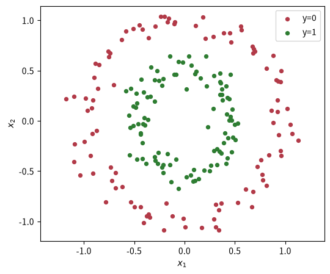
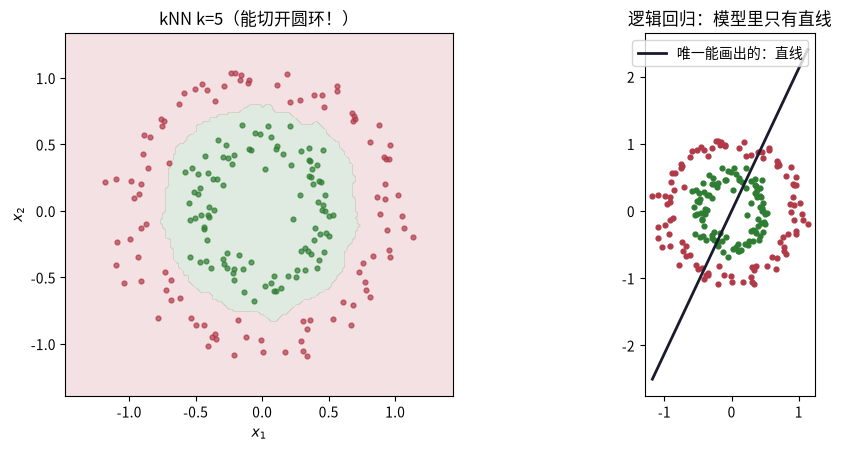
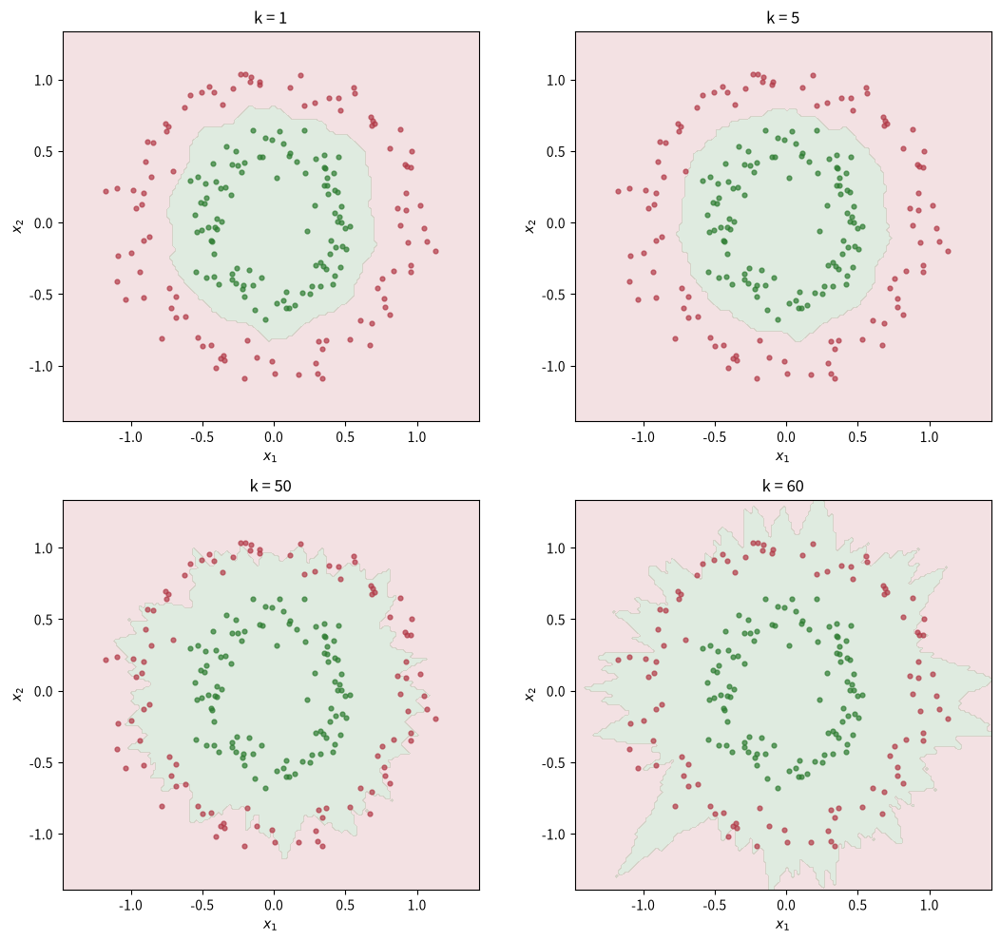
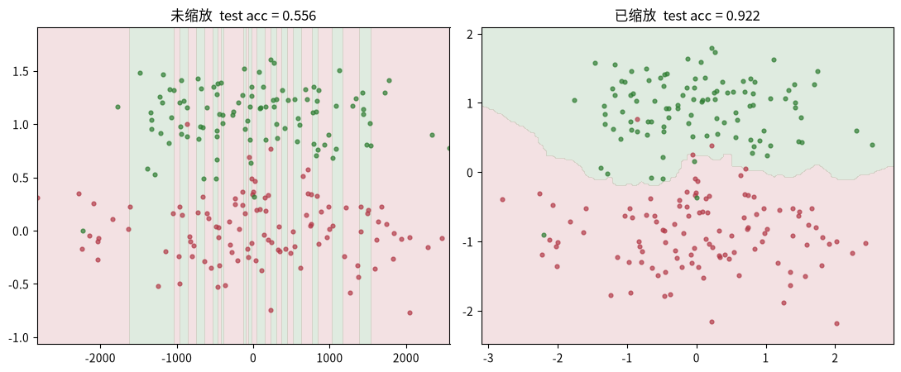

---
title: k 近邻（kNN）：不训练也能分类
published: 2026-08-11
description: kNN 三要素拆解：训练集即模型、多数投票即策略、预测时搜索即算法；手写零训练分类器，观察 k 的偏差-方差权衡与特征缩放的重要性。
tags: [机器学习, k近邻, 分类, 偏差-方差, 特征缩放]
category: 机器学习
draft: false
prevTitle: "朴素贝叶斯：生成模型视角"
prevSlug: "机器学习/0006-朴素贝叶斯"
nextTitle: "逻辑回归：把线性模型搬到分类"
nextSlug: "机器学习/0004-逻辑回归"
---

# k 近邻（kNN）：不训练也能分类

这是机器学习系列课程笔记的第 5 课（前置：课程 0004）。上一课逻辑回归在同心圆数据上「无能为力」，因为它的「模型」只有直线。本课主角 kNN 完全不需要「训练」，却能把圆环漂亮地切开——区别就藏在三要素里。

回顾三要素（李航）：**模型** = 候选函数集合，**策略** = 判断好坏的标准，**算法** = 怎么搜。读完请回答：kNN 的「算法」和逻辑回归的「算法」有什么本质区别？

---

## 一、知识点

### 三要素：这次「算法」没有训练

- **模型**：没有参数——训练集 + 距离度量 + k。预测时才「学习」，叫**惰性学习（lazy learning）/ 实例学习（instance-based）**。
- **策略**：多数投票（分类）/ 平均（回归）；距离度量也是策略的一部分。
- **算法**：预测时：算距离 → 排序 → 取前 k → 投票。大数据量下用 **kd 树** 加速（sklearn 可选），但思想不变。

**关键对比**：逻辑回归的「算法」（梯度下降）发生在训练阶段；kNN 的「算法」发生在预测阶段。同一个三要素框架，两种完全不同的节奏——这正是三要素框架好用的地方。

### 三个必懂点

**1. 边界是任意形状的**：kNN 不假设任何函数形式，边界由训练样本密度决定。所以它能分逻辑回归切不开的数据。代价是：预测要遍历所有样本，**惰性 = 预测慢**。

**2. k 是又一次偏差-方差权衡**：

- k 太小（如 1）→ 只看最近点，边界锯齿、对噪声敏感 → **高方差（过拟合）**
- k 太大（如 200）→ 边界太平滑、细节被抹掉 → **高偏差（欠拟合）**
- k 是**超参数**，用交叉验证在验证集上选，不靠训练。

这正是课程 0003 的偏差-方差权衡在 kNN 里的版本。

**3. 特征必须缩放**：距离由量纲主导——特征 A 范围 0~1000、特征 B 范围 0~1 时，A 的差异完全吞掉 B 的信息。用 `StandardScaler` 标准化（减去均值、除以标准差）后再算距离。

### 推荐阅读

- **李航《统计学习方法》§3 k 近邻法** —— k 近邻模型的几何意义（Voronoi 划分）、kd 树实现。[豆瓣页面](https://book.douban.com/subject/33437381/)。
- **ISL 第 2 章** —— KNN 与线性模型的对比、为什么 KNN 在高维失效（维数灾难）。[statlearning.com](https://www.statlearning.com/)。

---

## 二、动手实践

### 数据：逻辑回归切不开的同心圆

直接用课程 0004 练习 M2 的同心圆数据——内圈 y=0，外圈 y=1。

```python
import numpy as np
import matplotlib.pyplot as plt

from sklearn.datasets import make_circles

X, y = make_circles(n_samples=200, noise=0.08, factor=0.5, random_state=0)
print("X 形状：", X.shape, "  标签取值：", np.unique(y))

plt.figure(figsize=(6, 5))
plt.scatter(X[y == 0, 0], X[y == 0, 1], c="#b23a48", s=18, label="y=0")
plt.scatter(X[y == 1, 0], X[y == 1, 1], c="#2e7d32", s=18, label="y=1")
plt.axis("equal"); plt.xlabel("$x_1$"); plt.ylabel("$x_2$"); plt.legend(); plt.show()
```

同心圆数据集：类 0 在内环、类 1 在外环，逻辑回归的直线模型切不开它。



### 手写 kNN：训练一次都没有！

注意：下面的函数里没有任何 for 循环的「训练」——它只在预测时做事：算距离 → 排序 → 取前 k → 多数投票。

```python
def predict_knn(X_train: np.ndarray, y_train: np.ndarray,
                X_test: np.ndarray, k: int) -> np.ndarray:
    """欧氏距离 + 多数投票。d 是 (n_test, n_train) 的距离矩阵。"""
    d = ((X_train[None, :, :] - X_test[:, None, :]) ** 2).sum(axis=-1)   # (n_test, n_train)
    # X_train[None] 形状 (1, n_train, n_features)，X_test[:, None] 形状 (n_test, 1, n_features)
    # 广播后得到 (n_test, n_train, n_features) 的差值矩阵，平方后按最后一维求和得到距离矩阵
    idx = np.argsort(d, axis=-1)[:, :k]        # 每个测试样本的 k 个最近邻索引 [n_test, k]
    votes = y_train[idx]                       # 对应的 k 个最近邻标签 [n_test, k]
    return np.array([np.bincount(v.astype(int)).argmax() for v in votes])
    # bincount 统计每个标签出现次数，argmax 返回出现次数最多的标签

acc = float(np.mean(predict_knn(X, y, X, k=5) == y))
print(f"k=5 在训练集上的回代准确率：{acc:.3f}（这只是参考，真正看泛化要分 train/test）")
```

### 决策边界：任意形状

在平面上铺满网格点，让 kNN 逐个分类，画出边界，并与逻辑回归的直线对比。

```python
def plot_boundary(X, y, k, ax, title=None):
    x1 = np.linspace(X[:, 0].min() - 0.3, X[:, 0].max() + 0.3, 150)
    x2 = np.linspace(X[:, 1].min() - 0.3, X[:, 1].max() + 0.3, 150)
    xx, yy = np.meshgrid(x1, x2)        # 画多维图就是多了个网格化步骤
    Z = predict_knn(X, y, np.vstack([xx.ravel(), yy.ravel()]).T, k).reshape(xx.shape)
    ax.contourf(xx, yy, Z, levels=1, colors=["#b23a48", "#2e7d32"], alpha=0.15)
    ax.scatter(X[y == 0, 0], X[y == 0, 1], c="#b23a48", s=12, alpha=0.7)
    ax.scatter(X[y == 1, 0], X[y == 1, 1], c="#2e7d32", s=12, alpha=0.7)
    ax.set_title(title or f"k = {k}"); ax.set_xlabel("$x_1$"); ax.set_ylabel("$x_2$")
    ax.set_aspect("equal")

fig, axes = plt.subplots(1, 2, figsize=(11, 4.6))
plot_boundary(X, y, 5, axes[0], "kNN k=5（能切开圆环！）")

from sklearn.linear_model import LogisticRegression
lr = LogisticRegression().fit(X, y)
x1 = np.linspace(X[:, 0].min(), X[:, 0].max(), 200)
w, b = lr.coef_.ravel(), lr.intercept_[0]
x2 = -(w[0] * x1 + b) / w[1]
axes[1].scatter(X[y == 0, 0], X[y == 0, 1], c="#b23a48", s=12)
axes[1].scatter(X[y == 1, 0], X[y == 1, 1], c="#2e7d32", s=12)
axes[1].plot(x1, x2, color="#1a1a2e", lw=2, label="唯一能画出的：直线")
axes[1].set_title("逻辑回归：模型里只有直线"); axes[1].legend(); axes[1].set_aspect("equal")
plt.tight_layout(); plt.show()
```

`contourf` 填充等高区域，levels=1 只画一条分界线分成两大块，红色代表类 0 区域、绿色代表类 1 区域，透明度 0.15 避免遮挡散点。



### k 的选择：又一次偏差-方差权衡

k 太小边界锯齿状，k 太大边界太平滑。这正是课程 0003 的偏差-方差权衡在 kNN 里的版本。

```python
fig, axes = plt.subplots(2, 2, figsize=(11, 10))
for ax, k in zip(axes.ravel(), [1, 5, 50, 60]):
    plot_boundary(X, y, k, ax, f"k = {k}")
plt.tight_layout(); plt.show()
```

k=1 时每个样本独自圈领地、边界碎；k 增大边界越来越平滑。



### 特征缩放：距离的隐藏陷阱

距离「近不近」取决于每个特征的量纲。$x_1$ 范围 0~1000、$x_2$ 范围 0~1 时，距离会被 $x_1$ 完全主导，$x_2$ 的信息就废了。**先标准化（减去均值、除以标准差），再算距离**。

```python
from sklearn.preprocessing import StandardScaler
from sklearn.model_selection import train_test_split

rng = np.random.default_rng(3)
n = 150
# 类 0 与类 1 只在 x2 上分开；x1 是纯噪声
Xraw = np.vstack([
    rng.normal([0, 0.0], [1.0, 0.3], (n, 2)),
    rng.normal([0, 1.0], [1.0, 0.3], (n, 2)),
])
yraw = np.concatenate([np.zeros(n), np.ones(n)])
X_bad = Xraw * np.array([1000.0, 1.0])           # 人为放大 x1 量纲
X_std = StandardScaler().fit_transform(Xraw)     # 标准化

Xb_tr, Xb_te, yb_tr, yb_te = train_test_split(X_bad, yraw, test_size=0.3, random_state=0)
Xs_tr, Xs_te, ys_tr, ys_te = train_test_split(X_std, yraw, test_size=0.3, random_state=0)

acc_bad = float(np.mean(predict_knn(Xb_tr, yb_tr, Xb_te, k=5) == yb_te))
acc_std = float(np.mean(predict_knn(Xs_tr, ys_tr, Xs_te, k=5) == ys_te))
print(f"未缩放  test acc = {acc_bad:.3f}")
print(f"已缩放  test acc = {acc_std:.3f}")

# 画两个边界对比
x1 = np.linspace(Xb_tr[:, 0].min() - 0.3, Xb_tr[:, 0].max() + 0.3, 150)
x2 = np.linspace(Xb_tr[:, 1].min() - 0.3, Xb_tr[:, 1].max() + 0.3, 150)
xx, yy = np.meshgrid(x1, x2)
Z_bad = predict_knn(Xb_tr, yb_tr, np.vstack([xx.ravel(), yy.ravel()]).T, k=5).reshape(xx.shape)
x1 = np.linspace(Xs_tr[:, 0].min() - 0.3, Xs_tr[:, 0].max() + 0.3, 150)
x2 = np.linspace(Xs_tr[:, 1].min() - 0.3, Xs_tr[:, 1].max() + 0.3, 150)
xx_s, yy_s = np.meshgrid(x1, x2)
Z_std = predict_knn(Xs_tr, ys_tr, np.vstack([xx_s.ravel(), yy_s.ravel()]).T, k=5).reshape(xx_s.shape)

fig, axes = plt.subplots(1, 2, figsize=(11, 4.6))
axes[0].contourf(xx, yy, Z_bad, levels=1, colors=["#b23a48", "#2e7d32"], alpha=0.15)
axes[0].scatter(Xb_tr[yb_tr == 0, 0], Xb_tr[yb_tr == 0, 1], c="#b23a48", s=12, alpha=0.7)
axes[0].scatter(Xb_tr[yb_tr == 1, 0], Xb_tr[yb_tr == 1, 1], c="#2e7d32", s=12, alpha=0.7)
axes[0].set_title("未缩放  test acc = %.3f" % acc_bad)
axes[1].contourf(xx_s, yy_s, Z_std, levels=1, colors=["#b23a48", "#2e7d32"], alpha=0.15)
axes[1].scatter(Xs_tr[ys_tr == 0, 0], Xs_tr[ys_tr == 0, 1], c="#b23a48", s=12, alpha=0.7)
axes[1].scatter(Xs_tr[ys_tr == 1, 0], Xs_tr[ys_tr == 1, 1], c="#2e7d32", s=12, alpha=0.7)
axes[1].set_title("已缩放  test acc = %.3f" % acc_std)
axes[1].set_aspect("equal")
plt.tight_layout(); plt.show()
```

类 0 与类 1 只在 $x_2$ 上分开，$x_1$ 是纯噪声。未缩放时 $x_1$ 的量纲差完全主导距离，测试准确率明显更差；标准化后 $x_2$ 的信息被恢复，准确率大幅提升。



### 小结：kNN vs 逻辑回归

| | kNN | 逻辑回归 |
|---|---|---|
| 模型 | 训练集+距离+k（无参数） | σ(wᵀx+b)（参数化） |
| 策略 | 多数投票 / 平均 | 交叉熵 |
| 算法 | 预测时暴力搜索 | 训练时梯度下降 |
| 边界 | 任意形状 | 直线 |
| 需要的样本 | 越多越好（惰性，预测慢） | 较少（参数少） |
| 可解释性 | 看邻居即可解释 | 看权重即可解释 |

---

## 三、练习

### S1. k=1 时边界为什么锯齿状？

题目描述：把 `make_circles` 的 `noise` 调到 0.3，重画 k=1 和 k=50 的边界，观察准确率变化。这对应偏差还是方差？

<details>
<summary>答案</summary>
<p>k=1 时只看最近的一个点，每个样本独自圈领地，边界碎、对噪声敏感——这是高方差（过拟合）。noise 加大后 k=1 的边界会被噪声撕得更碎、错误明显变多；k=50 边界平滑、忽略噪声细节，但可能把真实的环形细节也抹掉（高偏差）。</p>
</details>

### S2. make_moons 数据集

题目描述：改用 `make_moons(noise=0.1)` 数据集重画边界。同样是线性不可分，kNN 的边界是什么形状？

<details>
<summary>答案</summary>
<p>kNN 不假设任何函数形式，边界由样本密度决定，会画出沿两个月牙形状的弯曲边界（而不是直线），再次体现「任意形状」的模型能力。</p>
</details>

### M1. 缩放对逻辑回归重要吗？

题目描述：上面特征缩放实验里，把 `np.array([1000.0, 1.0])` 的 1000 改成 1，未缩放还会那么差吗？为什么？再想想：缩放对逻辑回归重要吗？（提示：梯度下降的收敛速度）

<details>
<summary>答案</summary>
<p>改成 1 后两个特征量纲一致，距离不再被单一特征主导，未缩放的 kNN 也能正常区分，准确率不再差。缩放对逻辑回归（以及所有基于梯度下降的方法）同样重要：特征量纲差异大时，损失函数的等高线变得狭长，梯度下降收敛变慢、甚至震荡。</p>
</details>

### M2. sklearn 对比与 kd 树

题目描述：用 sklearn 的 `KNeighborsClassifier(n_neighbors=5)` 复现上面结果，并对比 `algorithm="kd_tree"` 与默认暴力搜索在 `make_blobs` 大样本（n=50000）下的耗时。

<details>
<summary>答案</summary>
<p>用 sklearn 的 <code>KNeighborsClassifier(n_neighbors=5)</code> 复现，结果应与手写版一致。对比 <code>algorithm="kd_tree"</code> 与默认暴力搜索：在 n=50000 的大样本上，kd 树利用树结构剪枝，预测耗时常明显低于暴力搜索——暴力法必须对每个新点算到全部训练点的距离。</p>
</details>

### H1. 曼哈顿距离版 kNN

题目描述：实现曼哈顿距离版 kNN：距离 = Σ|x₁−x₂|。在同心圆和月牙两个数据集上和欧氏距离对比准确率，结论是什么？

<details>
<summary>答案</summary>
<p>把平方差求和换成绝对值求和（<code>d = np.abs(X_train[None] - X_test[:, None]).sum(axis=-1)</code>）即可。在同心圆/月牙这类各向同性的数据上，两种距离的准确率通常很接近；差异主要体现在坐标系方向上——若特征轴方向与类别分离方向一致，曼哈顿距离可能略好。</p>
</details>

### H2. 手动交叉验证选 k

题目描述：把训练集再分成 80/20（train/val），k 从 1 扫到 120，画出「k vs 验证集准确率」曲线，指出最佳 k，并用偏差-方差解释曲线的形状。

<details>
<summary>答案</summary>
<p>曲线呈钟形：k 很小时模型高方差（过拟合），验证集准确率低；随 k 增大准确率上升、达到峰值（最佳 k）；继续增大则高偏差（欠拟合），准确率回落。用偏差-方差解释：小 k 方差主导、大 k 偏差主导，中间是两者的平衡点。</p>
</details>

---

## 四、测验

### 测验 1
问题：kNN 的「训练」发生在什么时候？
选项：A. 训练阶段 / B. 调参阶段 / C. 正则阶段 / D. 预测阶段（正确）

<details>
<summary>答案与解析</summary>
<p><strong>答案：D</strong>。kNN 是惰性学习：不学参数，预测时才找近邻投票。</p>
</details>

### 测验 2
问题：k=1 时的决策边界通常表现为？
选项：A. 平滑规则 / B. 一条直线 / C. 没有边界 / D. 锯齿状（正确）

<details>
<summary>答案与解析</summary>
<p><strong>答案：D</strong>。k=1 每个样本独自圈领地，边界碎、对噪声敏感——高方差。</p>
</details>

### 测验 3
问题：kNN 使用前必须做什么预处理？
选项：A. 标准化 / B. 独热编码 / C. 数据增强 / D. 特征缩放（正确）

<details>
<summary>答案与解析</summary>
<p><strong>答案：D</strong>。距离度量依赖量纲，特征必须缩放到同一尺度。</p>
</details>

### 测验 4
问题：k 是什么参数，怎么确定？
选项：A. 训练参数 / B. 随机参数 / C. 固定参数 / D. 超参数（正确）

<details>
<summary>答案与解析</summary>
<p><strong>答案：D</strong>。k 是超参数，用交叉验证在验证集上选。</p>
</details>

---

## 五、小结

kNN 用同一个三要素框架给出了完全不同的答案：模型没有参数、算法不发生在训练阶段、预测时才「学习」，代价是预测慢；而它任意形状的决策边界正好补上了逻辑回归「只有直线」的短板。这节课也再次敲响了偏差-方差的钟——k 的大小就是调节 bias-variance 的旋钮。下一课朴素贝叶斯将从「看邻居」换成「算概率」，把生成模型的视角引入工具箱。
| [← 上一课](/my-blog/posts/机器学习/0006-朴素贝叶斯/) | [课程目录](/my-blog/posts/机器学习/0001-机器学习全景与学习路线图/) | [下一课 →](/my-blog/posts/机器学习/0004-逻辑回归/) |
