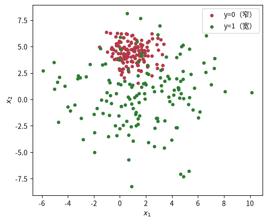
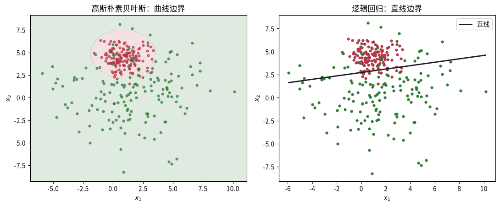

# 朴素贝叶斯：生成模型视角

这是机器学习系列课程笔记的第 6 课（前置：课程 0004 逻辑回归）。前两课（逻辑回归、kNN）本质都是**判别式**思路：想办法画出类别之间的边界。朴素贝叶斯换一条完全不同的路——它不去画边界，而是**把每一类长什么样建模出来**，再用贝叶斯公式反推该分到哪类。这是你工具箱里第一个**生成模型**。

> 读完请回答：为什么一个「假设几乎必然错误」的模型（条件独立），实战中却很好用？

---

## 一、知识点

### 贝叶斯公式：从似然到后验

$$P(y|x) = \frac{P(x|y)P(y)}{P(x)}$$

- $P(y)$：**先验** —— 类出现的比例
- $P(x|y)$：**似然** —— 该类下特征长这样（本）的概率
- $P(x)$：与类别无关，分类时可不看（每类都一样）

对每个新样本，比较「各类后验」的大小，取最大者。因为 $P(x)$ 对所有类相同，只要比较 $P(x|y)P(y)$ 的相对大小即可。

### 「朴素」：条件独立假设

为了不估计庞大的联合概率 $P(x|y)$，朴素贝叶斯假设**特征在给定类别时条件独立**：

$$P(x|y) = P(x_1|y)P(x_2|y)\cdots P(x_d|y)$$

- **好处**：参数从指数级降到线性级，训练只是「数数」（快、小样本友好、天然支持在线更新）。
- **代价**：假设几乎总不成立——但这往往是「买得起的错误」（见练习 S1）。

### 三要素

- **模型**：生成式——P(y) 先验 + P(x|y) 似然（条件独立分解）。连续特征用高斯，离散特征用频率。
- **策略**：极大似然估计参数；预测时最大后验（argmax P(y|x)）。
- **算法**：训练＝统计（均值/方差或频数）；预测＝贝叶斯公式逐类打分。

### 拉普拉斯平滑

离散特征（如文本里的词）用频率估计概率。训练里没见过的「特征-类」组合概率为 0，会让整个后验塌成 0。加**拉普拉斯平滑**：

$$P(x_j = v \mid y=k) = \frac{\text{count}(x_j=v,\, y=k) + \alpha}{N_k + \alpha \cdot V_j}$$

$\alpha$ 是平滑系数（常取 1），$V_j$ 是第 j 个特征取值个数。

### 推荐阅读

- **李航《统计学习方法》§4 朴素贝叶斯法** —— 从极大似然到贝叶斯估计的完整推导、拉普拉斯平滑。[豆瓣页面](https://book.douban.com/subject/33437381/)。
- **ISL 第 4 章** —— 贝叶斯分类器与判别分析的对比（LDA/QDA 就是同方差/异方差版本）。[statlearning.com](https://www.statlearning.com/)。

---

## 二、动手实践

### 问题设定：两类高斯，方差不同

类 0 的方差小、类 1 的方差大。方差不同正是本课的关键——它会让贝叶斯分类边界**变弯**。

```python
import numpy as np
import matplotlib.pyplot as plt

from sklearn.datasets import make_blobs

X, y = make_blobs(n_samples=300, centers=2, cluster_std=[1.0, 3.0], random_state=0)
print("X:", X.shape, " 类数:", len(np.unique(y)))

plt.figure(figsize=(6, 5))
plt.scatter(X[y == 0, 0], X[y == 0, 1], c="#b23a48", s=16, label="y=0（窄）")
plt.scatter(X[y == 1, 0], X[y == 1, 1], c="#2e7d32", s=16, label="y=1（宽）")
plt.xlabel("$x_1$"); plt.ylabel("$x_2$"); plt.legend(); plt.show()
```

两类高斯：类 0 窄、类 1 宽，方差不同是后面边界变弯的关键。



### 手写高斯朴素贝叶斯

连续特征：假设每类的每个特征服从一维高斯分布，用训练数据估计均值与方差（这就是「策略」：极大似然）。训练「算法」就是统计——每类的先验、每类每特征的均值/方差。预测时在**对数空间**算后验，避免概率连乘下溢。

```python
def fit_gauss_nb(X_train, y_train):
    """估计参数：先验 P(y) 和 每类每特征的 (μ, σ)。返回 (classes, priors, params)。"""
    classes = np.unique(y_train)
    priors = {k: float(np.mean(y_train == k)) for k in classes}
    params = {}
    for k in classes:
        Xk = X_train[y_train == k]
        params[k] = (Xk.mean(axis=0), Xk.std(axis=0, ddof=0) + 1e-9)  # MLE，加 eps 防除零
    return classes, priors, params

def predict_gauss_nb(classes, priors, params, X_test):
    """对数后验取最大：log P(y) + Σ log P(x_j|y)。"""
    preds = []
    for xt in X_test:
        best_k, best_lp = None, -np.inf
        for k in classes:
            mu, sd = params[k]
            logp_x = np.sum(-0.5 * np.log(2 * np.pi * sd**2) - 0.5 * ((xt - mu) / sd) ** 2)
            lp = np.log(priors[k]) + logp_x
            if lp > best_lp:
                best_k, best_lp = k, lp
        preds.append(best_k)
    return np.array(preds)

classes, priors, params = fit_gauss_nb(X, y)
print("先验 P(y)：", {int(k): round(v, 3) for k, v in priors.items()})
for k in classes:
    mu, sd = params[k]
    print(f"类 {int(k)}：μ = {np.round(mu, 3)}，σ = {np.round(sd, 3)}")
print("回代准确率：", round(float(np.mean(predict_gauss_nb(classes, priors, params, X) == y)), 3))
```

### 决策边界：贝叶斯是曲线，逻辑回归是直线

两类方差不同 ⇒ 后验相等的点构成**二次曲线**。这就是生成模型的「模型」与判别模型的区别。

```python
def plot_gauss_nb_boundary(X, y, ax, title):
    classes, priors, params = fit_gauss_nb(X, y)
    x1 = np.linspace(X[:, 0].min() - 1, X[:, 0].max() + 1, 200)
    x2 = np.linspace(X[:, 1].min() - 1, X[:, 1].max() + 1, 200)
    xx, yy = np.meshgrid(x1, x2)
    Z = predict_gauss_nb(classes, priors, params, np.c_[xx.ravel(), yy.ravel()]).reshape(xx.shape)
    ax.contourf(xx, yy, Z, levels=1, colors=["#b23a48", "#2e7d32"], alpha=0.15)
    ax.scatter(X[y == 0, 0], X[y == 0, 1], c="#b23a48", s=12, alpha=0.7)
    ax.scatter(X[y == 1, 0], X[y == 1, 1], c="#2e7d32", s=12, alpha=0.7)
    ax.set_title(title); ax.set_xlabel("$x_1$"); ax.set_ylabel("$x_2$")

fig, axes = plt.subplots(1, 2, figsize=(11, 4.6))
plot_gauss_nb_boundary(X, y, axes[0], "高斯朴素贝叶斯：曲线边界")

from sklearn.linear_model import LogisticRegression
lr = LogisticRegression().fit(X, y)
w, b = lr.coef_.ravel(), lr.intercept_[0]
x1 = np.linspace(X[:, 0].min(), X[:, 0].max(), 200)
axes[1].scatter(X[y == 0, 0], X[y == 0, 1], c="#b23a48", s=12)
axes[1].scatter(X[y == 1, 0], X[y == 1, 1], c="#2e7d32", s=12)
axes[1].plot(x1, -(w[0] * x1 + b) / w[1], color="#1a1a2e", lw=2, label="直线")
axes[1].set_title("逻辑回归：直线边界"); axes[1].set_xlabel("$x_1$"); axes[1].set_ylabel("$x_2$"); axes[1].legend()
plt.tight_layout(); plt.show()
```

方差不同让高斯朴素贝叶斯的边界弯曲，而逻辑回归仍只能画直线。



### 迷你垃圾邮件分类：朴素贝叶斯的看家本领

经典的文本分类用法：**词袋（bag of words）**。每个词是「特征」，看它在某类里出现多少次。这里用 7 条消息的小语料，标签 1=垃圾、0=正常，用**多项式朴素贝叶斯**（计数作为特征）做分类。

```python
corpus = [
    ("免费 中奖 点击 链接", 1),
    ("中奖 恭喜 快 来", 1),
    ("点击 领取 大奖", 1),
    ("今天 开会 讨论 项目", 0),
    ("会议 安排 在 下午", 0),
    ("报告 已经 写好", 0),
    ("明天 项目 进度 会", 0),
]
test_msg = ["中奖 链接 免费 比特币"]

train_texts = [t.split() for t, _ in corpus]
train_labels = np.array([lb for _, lb in corpus])
vocab = sorted({w for words in train_texts for w in words})
V = len(vocab)
print("词表：", vocab, " V =", V)

w2i = {w: i for i, w in enumerate(vocab)}

def multinomial_nb(train_texts, train_labels, alpha=1.0):
    """多项式朴素贝叶斯（计数作为特征），alpha=1.0 是拉普拉斯平滑参数。返回先验与每类每词的平滑对数概率。"""
    priors = {k: float(np.mean(train_labels == k)) for k in [0, 1]}
    counts = {k: np.zeros(V) for k in [0, 1]}
    for words, lb in zip(train_texts, train_labels):
        for w in words:
            counts[lb][w2i[w]] += 1
    logp = {}
    for k in [0, 1]:
        total = counts[k].sum() + alpha * V
        with np.errstate(divide="ignore", invalid="ignore"):
            logp[k] = np.log((counts[k] + alpha) / total)
    return priors, logp

priors, logp = multinomial_nb(train_texts, train_labels)
for k in [0, 1]:
    top = np.argsort(logp[k])[::-1][:3]
    print(f"类{k} 概率最高的词：", [(vocab[i], round(logp[k][i], 2)) for i in top])

def predict_text(words, priors, logp):
    scores = {}
    for k in [0, 1]:
        s = np.log(priors[k])
        for w in words:
            if w in w2i:
                s += logp[k][w2i[w]]
            else:
                s += np.log(0.01)   # 未登录词给个很小的概率，不判死
        scores[k] = s
    return max(scores, key=scores.get), scores

lab, scores = predict_text(test_msg[0].split(), priors, logp)
print(f"\n测试消息 {test_msg[0]!r} → 预测为 {'垃圾' if lab else '正常'}（对数得分 {np.round(list(scores.values()), 2)}）")
```

先验和每类每词的平滑对数概率都算好了。预测时把测试消息每个词的 log 概率累加，再加先验的对数，最后比较两类得分取最大。未登录词（训练里没见过的词）给一个很小的概率 0.01，不把它判死。

---

## 三、练习

### S1. 条件独立假设几乎总不成立，为什么朴素贝叶斯实战表现却不错？

题目描述：提示——分类只需要后验的 argmax，不需要精确概率。

<details>
<summary>答案</summary>
<p>分类只需要比较后验的相对大小、取 argmax，不需要概率绝对值精确。即使条件独立假设不成立，各类后验的排序通常仍能保持正确——所以一个「假设几乎必然错误」的模型，实战中却很好用。</p>
</details>

### S2. 方差不同为什么让边界变弯？

题目描述：把两类 `cluster_std` 都改成 1.0 重画边界，看它变成什么形状，并解释。

<details>
<summary>答案</summary>
<p>当两个类别高斯分布的方差（协方差）不一样时，后验相等的点构成二次曲线（双曲线/弯曲）。把 cluster_std 都改成 1.0（同方差）后，二次项互相抵消，边界会退化成一条直线。</p>
</details>

### M1. sklearn 对比

题目描述：用 sklearn 的 `GaussianNB` 对同一数据训练，和手写版对比准确率（应当完全一致）。

<details>
<summary>答案</summary>
<p>手写版与 sklearn 用的都是高斯似然 + 对数后验取最大，准确率应当完全一致：</p>

```python
from sklearn.naive_bayes import GaussianNB
model = GaussianNB().fit(X, y)
y_pred = model.predict(X)
print("回代准确率：", round(float(np.mean(y_pred == y)), 3))
```
</details>

### M2. alpha 平滑的作用

题目描述：在文本例子里把 `alpha` 从 0 扫到 5，观察类内词的平滑概率如何变化；`alpha=0` 时如果测试消息里出现训练没见过的词，会发生什么？

<details>
<summary>答案</summary>
<p>alpha 越大，各词的平滑概率越趋于均匀（向先验收缩）。alpha=0 时没见过的「词-类」组合计数为 0，log 0 = −∞，一个词就能让该类的后验塌成 −∞、被一票否决（这正是 HTML 里提示的「会议」一票否决垃圾类）。</p>
</details>

### H1. 伯努利朴素贝叶斯

题目描述：实现**伯努利朴素贝叶斯**：不看词频，只看「词是否出现」（0/1）。在同一语料上对比它与多项式版对测试消息的判定。

<details>
<summary>答案</summary>
<p>重复堆砌同一个词的垃圾消息：多项式贝叶斯会给很高分数（计数累加）；伯努利版只看词是否出现，不受重复词影响。短文本上伯努利往往不错，长文本多项式通常更占优。</p>
</details>

### H2. 未登录词（OOV）的处理

题目描述：给语料加一条「训练时未见过的新词」的测试消息（如「中奖 比特币」中「比特币」不在词表），说明平滑如何救场，并讨论未登录词（OOV）的一般处理办法。

<details>
<summary>答案</summary>
<p>拉普拉斯平滑给每个「词-类」组合一个最小计数，避免概率为 0，从而防止 log(0)=−∞ 一票否决整类。未登录词的一般处理：给一个很小的概率（如代码里的 0.01，不判死），或用 `<UNK>` 词表外标记统一统计、子词切分等。</p>
</details>

---

## 四、测验

### 测验 1
问题：朴素贝叶斯属于哪类模型？
选项：A. 判别模型 / B. 惰性模型 / C. 深度模型 / D. 生成模型（正确）

<details>
<summary>答案与解析</summary>
<p><strong>答案：D</strong>。它建模 P(x|y) 和 P(y)，再用贝叶斯公式反推——生成式思路。</p>
</details>

### 测验 2
问题：「朴素」二字指什么假设？
选项：A. 数据线性可分 / B. 特征互不影响 / C. 类别均衡分布 / D. 特征条件独立（正确）

<details>
<summary>答案与解析</summary>
<p><strong>答案：D</strong>。给定类别时特征条件独立，所以 P(x|y) 能拆成连乘。</p>
</details>

### 测验 3
问题：训练里某「特征-类」组合没出现，概率为 0 怎么办？
选项：A. 删除该类 / B. 忽略特征 / C. 加大样本 / D. 拉普拉斯平滑（正确）

<details>
<summary>答案与解析</summary>
<p><strong>答案：D</strong>。加 α 平滑，让每个计数至少有小概率，避免 log(0) 一票否决。</p>
</details>

### 测验 4
问题：连续特征的朴素贝叶斯通常假设？
选项：A. 均匀分布 / B. 泊松分布 / C. 二项分布 / D. 高斯分布（正确）

<details>
<summary>答案与解析</summary>
<p><strong>答案：D</strong>。高斯朴素贝叶斯：估计每类每特征的高斯参数（μ, σ）。</p>
</details>

---

## 五、小结

朴素贝叶斯把「概率」从逻辑回归的判别视角扩展到了生成视角：先建模每类的样子（先验 + 似然），再用贝叶斯公式反推后验。它与逻辑回归的分工很有意思——同方差时两者都能画出直线，异方差时生成模型给出更贴合分布的曲线边界；而「特征条件独立」这个看似必错的假设，因为分类只需要 argmax，成了「买得起的错误」。从回归、kNN 到朴素贝叶斯，你已经在同一个三要素框架下见识了三种完全不同的模型视角。下一课决策树将引入分而治之的规则树——也是集成学习（随机森林、梯度提升）的地基。