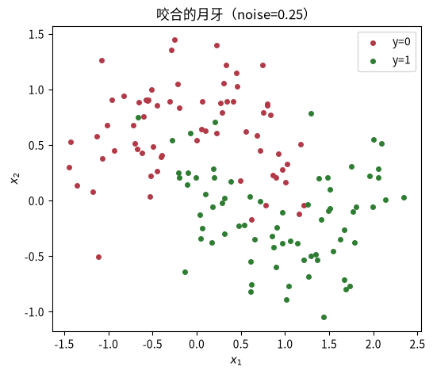
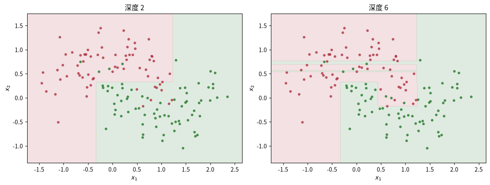
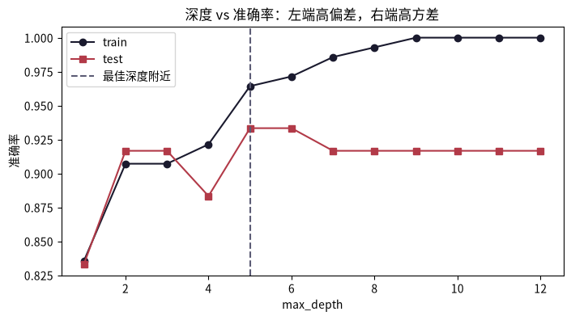
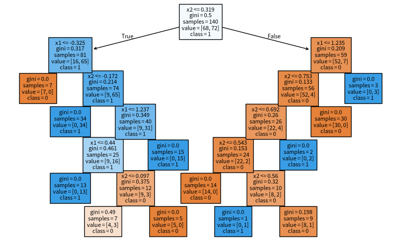
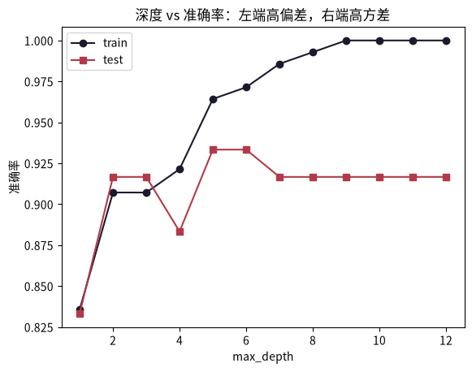

# 决策树：分而治之的规则树

这是机器学习系列课程笔记的第 7 课，前置知识是课程 0005 的偏差-方差权衡。前几课的「模型」都是数学函数（直线、超平面、概率分布），这一课完全不同：我们学习一棵 **if-then 规则树**——每个结点一个「是/否」判断，叶子给出类别。它天然可解释，也是后面随机森林与梯度提升的积木。

## 一、知识点

### 三要素

- **模型**：if-then 规则的集合；从根到叶的每条路径都是一条规则，规则之间互斥且完备。
- **策略**：每个结点挑「最能使子结点变纯」的特征分裂——用信息增益 / 基尼不纯度来度量。
- **算法**：贪心递归：选特征 → 分裂 → 递归；配以剪枝（预剪枝/后剪枝）防过拟合。

### 核心问题：怎么选分裂特征

树的每层都要问「按哪个特征、在什么阈值处切，能让两边的类别更纯」。衡量「纯度」有两种常用度量。

**信息增益（ID3/C4.5 用）**：先算结点的**熵**：

$$H(S) = -\sum p_i \log_2 p_i$$

越纯熵越低；全同类的叶熵 = 0。再算按特征 A 分裂后子结点熵的加权平均，两者的差就是**信息增益**：

$$\text{Gain}(S, A) = H(S) - \sum_v \frac{|S_v|}{|S|} H(S_v)$$

选增益最大的特征。

**基尼不纯度（CART 用）**：

$$Gini(S) = 1 - \sum p_i^2$$

越纯越小；全同类 = 0。scikit-learn 的 `DecisionTreeClassifier` 默认用基尼。两者选出的分裂往往很接近，实现上基尼更省算（不用 log）。

### 三个必懂点

**1. 树越深越容易过拟合。** 只要数据没有冲突，深度无限的增长可以把训练集「背下来」——但边界碎成锯齿，泛化差。控制方式：

- **预剪枝**：设 `max_depth`、`min_samples_leaf`，提前停。
- **后剪枝**：先长满再自底向上剪掉不带来验证集提升的子树。
- 这正是 0005 学过的偏差-方差权衡：浅 → 高偏差，深 → 高方差。

**2. 边界是「轴对齐」的矩形。** 每个结点只按**一个特征**切，所以决策边界永远是平行于坐标轴的阶梯形，而不是斜线。真实数据里的斜边界要用很多层来逼近——这就是为什么集成学习能大幅提升它。

**3. 它很好解释，但要小心过拟合与不稳定。** 「叶子里样本最多的类」就是预测；一条从根到叶的路径可以讲给人听（可解释性）。但贪心分裂意味着**训练数据的小扰动可能换一棵完全不同的树**——高方差，这也是它需要集成的主要原因。

### 推荐阅读

- 李航《统计学习方法》§5 决策树——信息增益、ID3/C4.5 与 CART 的完整推导、剪枝理论。[豆瓣页面](https://book.douban.com/subject/33437381/)。
- ISL 第 8 章（Tree-Based Methods）——决策树、装袋、随机森林与提升的衔接。[statlearning.com](https://www.statlearning.com/)。

---

## 二、动手实践

配套 notebook：`practice/0007_decision_tree.ipynb`，从零手写一个递归决策树，并对比 sklearn 版本。

### 问题设定：两个咬合的月牙

逻辑回归在同心圆上切不开，因为模型只有直线。决策树对形状没有预设——它用一堆**轴对齐的矩形块**去逼近任意边界。我们先用 `make_moons` 生成咬合月牙数据，看看它行不行。

```python
import numpy as np
import matplotlib.pyplot as plt
from sklearn.datasets import make_moons
from sklearn.model_selection import train_test_split

X, y = make_moons(n_samples=200, noise=0.25, random_state=0)
Xtr, Xte, ytr, yte = train_test_split(X, y, test_size=0.3, random_state=0)
print("train:", Xtr.shape, "test:", Xte.shape)

plt.figure(figsize=(6, 5))
plt.scatter(Xtr[ytr == 0, 0], Xtr[ytr == 0, 1], c="#b23a48", s=16, label="y=0")
plt.scatter(Xtr[ytr == 1, 0], Xtr[ytr == 1, 1], c="#2e7d32", s=16, label="y=1")
plt.xlabel("$x_1$"); plt.ylabel("$x_2$"); plt.legend(); plt.title("咬合的月牙（noise=0.25）")
plt.show()
```



两个类别像月牙一样咬合在一起，直线模型很难把它们分开。

### 先实现「纯度」的度量：熵

熵越低表示集合越纯。实现 `entropy`，并用几个小例子验证极端值。

```python
def entropy(y: np.ndarray) -> float:
    """熵 H(S) = -Σ p_i log2 p_i。越纯熵越低。"""
    if len(y) == 0:
        return 0.0
    _, counts = np.unique(y, return_counts=True)
    p = counts / len(y)     # 得到每一类的概率
    return float(-(p * np.log2(p)).sum())   # 计算整个数据集的熵

print("全同类：", round(entropy(np.array([0, 0, 0])), 4))      # 应为 0
print("两类各半：", round(entropy(np.array([0, 0, 1, 1])), 4))  # 应为 1.0
print("3:1：", round(entropy(np.array([0, 0, 0, 1])), 4))       # 介于 0 和 1 之间
```

全同类熵为 0，两类各半熵为 1，3:1 介于两者之间——熵完美刻画了「混杂程度」。

### 信息增益：选特征的标准

按特征 A 分裂后，子结点熵的加权平均比原来小多少，就是**信息增益**。连续特征（像我们的 $x_1, x_2$）要把取值排序，在相邻值中点试所有切分点，选增益最大的。

```python
def best_split(X: np.ndarray, y: np.ndarray):
    """在 (特征, 阈值) 里找信息增益最大的切分。返回 (增益, 特征索引, 阈值)。"""
    n = len(y)
    H = entropy(y)      # 先得到根结点的熵
    best_gain, best_f, best_t = -np.inf, None, None
    for f in range(X.shape[1]):     # X.shape[1] 是特征数，X:[样本数, 特征数]
        vals = np.unique(X[:, f])   # vals 是特征 f 的所有不同取值
        if len(vals) < 2:
            continue
        thresholds = (vals[:-1] + vals[1:]) / 2          # 相邻值中点作为候选切分点
        for t in thresholds:
            left = y[X[:, f] <= t]
            right = y[X[:, f] > t]
            gain = H - (len(left) / n * entropy(left) + len(right) / n * entropy(right))
            if gain > best_gain:
                best_gain, best_f, best_t = gain, f, t
    return best_gain, best_f, best_t

gain, f, t = best_split(Xtr, ytr)
print(f"根结点最优分裂：特征 x_{f}，阈值 {t:.3f}，信息增益 {gain:.4f}")
```

输出会告诉我们根结点最优分裂用的是哪个特征、在哪个阈值处切、信息增益有多大。

### 手写递归决策树

「算法」就是递归：选最优分裂 → 左右递归 → 直到纯 / 深度上限 / 信息增益为 0。预测时从根走到叶子，叶子返回多数类。

```python
class Node:
    __slots__ = ("feature", "threshold", "left", "right", "pred")
    def __init__(self):
        self.feature = None      # 分裂特征索引
        self.threshold = None    # 分裂阈值
        self.left = None
        self.right = None
        self.pred = None         # 叶子：多数类

def fit_tree(X, y, depth=0, max_depth=6):
    node = Node()
    if depth >= max_depth or len(np.unique(y)) == 1:
        node.pred = int(np.bincount(y.astype(int)).argmax())        # bincount输入只能是非负整数
        return node
    gain, f, t = best_split(X, y)
    if gain <= 0:
        node.pred = int(np.bincount(y.astype(int)).argmax())
        return node
    node.feature, node.threshold = f, t
    mask = X[:, f] <= t
    node.left = fit_tree(X[mask], y[mask], depth + 1, max_depth)    # 递归左子树
    node.right = fit_tree(X[~mask], y[~mask], depth + 1, max_depth) # 递归右子树
    return node

def predict_tree(node, X):
    out = np.empty(len(X), dtype=int)
    for i, x in enumerate(X):       # 对每个样本进行预测
        cur = node
        while cur.pred is None:     # 往下递归直到叶子结点
            cur = cur.left if x[cur.feature] <= cur.threshold else cur.right
        out[i] = cur.pred
    return out

tree = fit_tree(Xtr, ytr, max_depth=6)
print("train acc:", round(float(np.mean(predict_tree(tree, Xtr) == ytr)), 3))
print("test  acc:", round(float(np.mean(predict_tree(tree, Xte) == yte)), 3))
```

### 轴对齐的矩形边界

每个结点只按**一个特征**切一刀，所以决策边界是平行于坐标轴的阶梯形，而不是斜线。对比深度 2 和深度 6 的边界：

```python
def plot_tree_boundary(X, y, ax, tree, title):
    x1 = np.linspace(X[:, 0].min() - 0.3, X[:, 0].max() + 0.3, 300)
    x2 = np.linspace(X[:, 1].min() - 0.3, X[:, 1].max() + 0.3, 300)
    xx, yy = np.meshgrid(x1, x2)
    Z = predict_tree(tree, np.c_[xx.ravel(), yy.ravel()]).reshape(xx.shape)
    ax.contourf(xx, yy, Z, levels=1, colors=["#b23a48", "#2e7d32"], alpha=0.15)
    ax.scatter(X[y == 0, 0], X[y == 0, 1], c="#b23a48", s=12, alpha=0.8)
    ax.scatter(X[y == 1, 0], X[y == 1, 1], c="#2e7d32", s=12, alpha=0.8)
    ax.set_title(title); ax.set_xlabel("$x_1$"); ax.set_ylabel("$x_2$")

fig, axes = plt.subplots(1, 2, figsize=(12, 4.6))
plot_tree_boundary(Xtr, ytr, axes[0], fit_tree(Xtr, ytr, max_depth=2), "深度 2")
plot_tree_boundary(Xtr, ytr, axes[1], fit_tree(Xtr, ytr, max_depth=6), "深度 6")
plt.tight_layout(); plt.show()
```



深度 2 的边界很粗（只有几块大方块），深度 6 的边界明显更细碎——把边界折成了更小的矩形块去贴合数据。

### 深度 vs 过拟合：又一次偏差-方差

深度小 → 规则太粗（高偏差）；深度大 → 把训练集「背下来」（高方差）。最佳深度在中间。这就是 0005 学过的偏差-方差权衡在树上的翻版。

```python
depths = range(1, 13)
tr_acc, te_acc = [], []
for d in depths:
    t = fit_tree(Xtr, ytr, max_depth=d)
    tr_acc.append(np.mean(predict_tree(t, Xtr) == ytr))
    te_acc.append(np.mean(predict_tree(t, Xte) == yte))

plt.figure(figsize=(8, 4))
plt.plot(list(depths), tr_acc, "o-", label="train", color="#1a1a2e")
plt.plot(list(depths), te_acc, "s-", label="test", color="#b23a48")
plt.axvline(5, ls="--", color="#5c5c75", label="最佳深度附近")
plt.xlabel("max_depth"); plt.ylabel("准确率"); plt.legend()
plt.title("深度 vs 准确率：左端高偏差，右端高方差")
plt.show()
```



训练准确率随深度单调上升，测试准确率先升后降——左端高偏差（欠拟合），右端高方差（过拟合），最佳深度在中间（约 5）。

### sklearn 版：一行搞定 + 特征重要性

scikit-learn 的 `DecisionTreeClassifier` 默认用**基尼不纯度**（和熵几乎等价，但不用算 log）。它还给你树结构和特征重要性（每个特征参与分裂带来的纯度提升占比）。

```python
from sklearn.tree import DecisionTreeClassifier, plot_tree

clf = DecisionTreeClassifier(max_depth=6, random_state=0).fit(Xtr, ytr)
print("sklearn test acc:", round(float(clf.score(Xte, yte)), 3))
print("特征重要性 x1, x2：", np.round(clf.feature_importances_, 3))

fig, ax = plt.subplots(1, 1, figsize=(10, 6))
plot_tree(clf, ax=ax, filled=True, feature_names=["x1", "x2"], class_names=["0", "1"], fontsize=8)
plt.show()
```



sklearn 把整棵树画了出来：每个结点标注了分裂特征、阈值、基尼不纯度、样本数与类别分布，叶子结点的颜色深浅反映纯度。

---

## 三、练习

练习分三档：S 理解 / M 动手 / H 挑战。答案折叠在下方，先自己动手再对答案。

### S1. 为什么决策树的边界总是平行于坐标轴的直线段，不能是斜线？

题目描述：思考决策树每次分裂只按一个特征切一刀这个事实，回答为什么边界不能是斜线，以及斜边界要怎样才表达得出来。

<details>
<summary>答案</summary>
<p>多棵决策树集成（随机森林、梯度提升树），多棵轴平行边界叠加，可以近似拟合斜线、非线性边界。单棵树每次分裂只按单个特征、单个阈值切，切出来的只能是平行于坐标轴的线段，要靠堆叠多层或集成多棵树才能逼近斜线。</p>
</details>

### S2. 熵的极端值

题目描述：全同类的熵是 0；某结点里两类各占一半，熵是 1。试想一个类别占比为 $p$ 的结点，画出 H(p) 随 p 的曲线（0 到 1），解释为什么「越接近 0.5 越难决策」。

<details>
<summary>答案</summary>
<p>熵越大系统越不确定，信息增益越大，说明该特征对分类的贡献越大。当 $p = 0.5$ 时熵取最大值 1，此时两类完全混杂、最难决策；越接近 0 或 1，熵越小，决策越容易。</p>
</details>

### M1. 换成 criterion="entropy"

题目描述：把 sklearn 的 `DecisionTreeClassifier` 换成 `criterion="entropy"`，对比手写版（同样是信息增益）在训练集上的准确率，应该几乎一致。

<details>
<summary>答案</summary>
<p><code>criterion="entropy"</code> 就是用信息增益做分裂，和 ID3 标准一致，因此与手写版结果几乎一致。对照代码：</p>

```python
from sklearn.tree import DecisionTreeClassifier
model = DecisionTreeClassifier(criterion='entropy', max_depth=5, random_state=0)
model.fit(Xtr, ytr)
print(model.score(Xtr, ytr))
print(model.score(Xte, yte))
```
</details>

### M2. 扫描 max_depth

题目描述：把 `max_depth` 从 1 扫到 15，打印 train/test 准确率；找出测试集上的最佳深度，并说明深度过大时你在观察的是「偏差」还是「方差」。

<details>
<summary>答案</summary>
<p>max_depth 很小：训练集、测试集准确率都低 → 高偏差（欠拟合），模型太简单。随着深度增加：训练集准确率持续上升；测试集率先上升，到达一个最高点后开始下降。max_depth 过大：训练集准确率几乎 100%，测试集准确率明显下滑 → 过拟合（高方差）。</p>

```python
from sklearn.tree import DecisionTreeClassifier
train_acc, test_acc = [], []
for d in range(1, 13):
    model = DecisionTreeClassifier(criterion='entropy', max_depth=d, random_state=0)
    model.fit(Xtr, ytr)
    train_acc.append(model.score(Xtr, ytr))
    test_acc.append(model.score(Xte, yte))

plt.plot(range(1, 13), train_acc, "o-", label="train", color="#1a1a2e")
plt.plot(range(1, 13), test_acc, "s-", label="test", color="#b23a48")
plt.xlabel("max_depth"); plt.ylabel("准确率"); plt.legend()
plt.title("深度 vs 准确率：左端高偏差，右端高方差")
plt.show()
```


</details>

### H1. 实现 gini

题目描述：实现 `gini(y)`（基尼不纯度 = $1 - \sum p_i^2$），并把 `best_split` 改成基尼版；在同一数据上对比它和熵版选出的根结点分裂，解释为什么二者通常接近。

<details>
<summary>答案</summary>

```python
def gini(y: np.ndarray) -> float:
    """基尼指数 G(S) = 1 - Σ p_i^2。越纯基尼越低。"""
    if len(y) == 0:
        return 0.0
    _, counts = np.unique(y, return_counts=True)
    p = counts / len(y)     # 得到每一类的概率
    return float(1 - (p ** 2).sum())   # 计算整个数据集的基尼指数
```

<p>香农熵和基尼不纯度两者变化趋势高度同步，都是衡量集合的混杂程度，所以选出的分裂往往很接近。</p>
</details>

### H2. 加一列纯随机噪声

题目描述：给训练数据加一列「纯随机噪声」特征（如 `np.random.default_rng(0).uniform(0, 1, n)`），看 sklearn 树的特征重要性——噪声列会不会也拿高重要性？这说明用特征重要性选特征时要小心什么？

<details>
<summary>答案</summary>
<p>随机噪声有可能得到较高特征重要性；特征重要性不可完全信赖，不能单独作为筛选特征的唯一依据，需要交叉验证佐证。</p>
</details>

---

## 四、测验

### 测验 1

问题：决策树的「模型」本质是什么？

选项：A. 线性函数 / B. 概率分布 / C. 距离度量 / D. if-then 规则集合 ✓

<details>
<summary>答案与解析</summary>
<p><strong>答案：D</strong>。每条根到叶的路径是一条规则，规则互斥且完备。</p>
</details>

### 测验 2

问题：分裂时选特征的标准是？

选项：A. 方差最大化 / B. 样本最多 / C. 特征最少 / D. 纯度提升最大 ✓

<details>
<summary>答案与解析</summary>
<p><strong>答案：D</strong>。信息增益/基尼度量的是分裂后子结点「变纯」的程度。</p>
</details>

### 测验 3

问题：纯结点的熵是多少？

选项：A. 0.5 / B. 1 / C. 2 / D. 0 ✓

<details>
<summary>答案与解析</summary>
<p><strong>答案：D</strong>。熵 $H = -\sum p \log_2 p$；p=1 时 = 0，全同类结点最纯。</p>
</details>

### 测验 4

问题：决策树的决策边界是什么形状？

选项：A. 任意光滑曲线 / B. 圆形 / C. 斜线 / D. 轴对齐的矩形 ✓

<details>
<summary>答案与解析</summary>
<p><strong>答案：D</strong>。每次只切一个特征 → 边界是平行于坐标轴的阶梯形。</p>
</details>

---

## 五、小结

决策树用「分而治之」的贪心递归把数据切成一组 if-then 规则：信息增益/基尼度量纯度决定每次分裂，剪枝控制复杂度。深度就是一次典型的偏差-方差权衡——浅了欠拟合、深了过拟合。它可解释性强，但单棵树不稳定，这为下一课「集成学习」埋下了伏笔：用一群小树投票，把方差抵消掉。