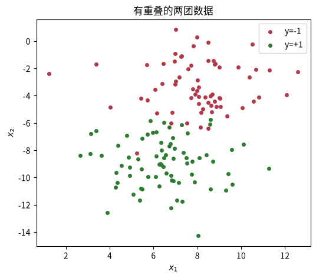
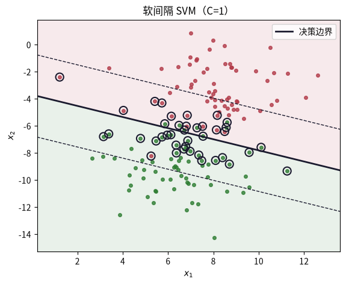
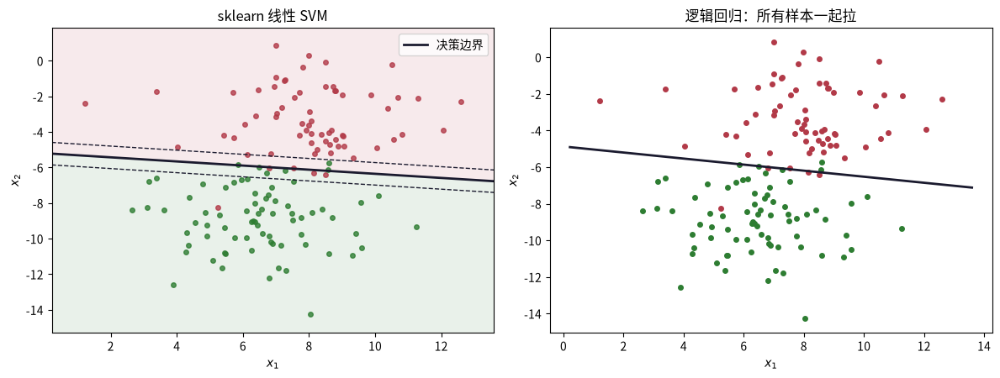
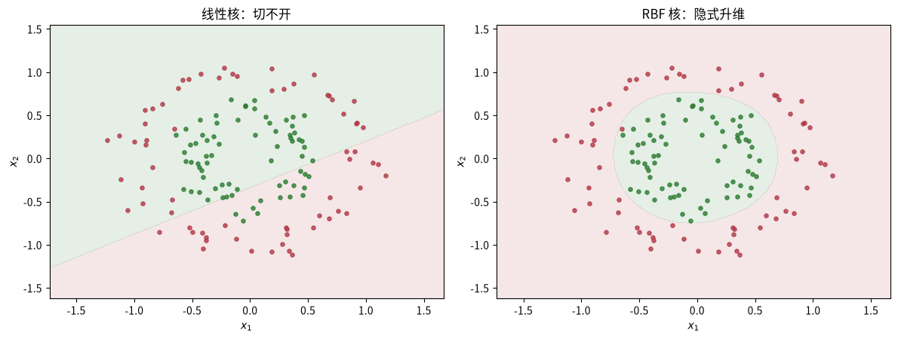

---
title: SVM：一条有「间隔」的直线
published: 2026-08-14
description: 支持向量机（SVM）只关心离边界最近的少数样本并用最大间隔把它们推开。本课从合页损失出发手写软间隔 SVM，理解支持向量与核技巧，并对比逻辑回归。
tags: [机器学习, SVM, 支持向量机, 核技巧]
category: 机器学习
draft: false
prevTitle: "集成学习：Bagging 与随机森林"
prevSlug: "机器学习/0009-集成学习"
nextTitle: "决策树：分而治之的规则树"
nextSlug: "机器学习/0007-决策树"
---

# SVM：一条有「间隔」的直线

这是机器学习系列课程笔记的第 8 课，前置课程是 0004（逻辑回归）与 0007（决策树）。逻辑回归的边界被「所有样本」拉扯，边界附近的离群点会拉扯它；SVM 换一个思路：**只找一条离两类样本都尽量远的直线**——它只由离边界最近的少数几个样本（**支持向量**）决定。这带来了更强的泛化，也带来一个优雅的数学副产品：**核技巧**。

## 一、知识点

### 三要素

- **模型**：超平面 $w^\top x + b = 0$，加上两侧的间隔带。决策边界只是「带子的中线」。
- **策略**：最大化几何间隔（等价于最小化 $\frac{1}{2}\|w\|^2$），软间隔版本允许少量误分类，用 C 权衡。
- **算法**：凸二次规划的对偶问题；用拉格朗日乘子，让内积可被核函数替换（核技巧）。

### 核心：间隔越大越「稳」

几何间隔 $\gamma = \frac{1}{\|w\|}$。想清楚一件事：**最大化间隔 = 最小化 $\|w\|$**。同样的训练误差，间隔越宽的直线对测试样本的容错越强——这就是 SVM 泛化好的来源。

### 三个必懂点

**1. 边界只由支持向量决定。** 间隔带边缘上的样本（以及软间隔下违规的样本）就是支持向量。去掉其它所有样本，解不变。因此：

- 模型「稀疏」：预测只算支持向量的内积，训练集越大越显优势。
- 这也是为什么对偶问题的变量数 = 样本数 N，但真正非零的乘子很少。

**2. C 是又一次偏差-方差权衡。** C 惩罚「间隔内的违规样本」：

- **C 大** → 更不宽容违规 → 间隔变窄、边界贴着样本 → 高方差。
- **C 小** → 容忍更多违规 → 间隔宽、边界平滑 → 高偏差。
- 同样的故事你已经在 kNN 的 k、决策树的深度上见过——这是贯穿本课程的主线。

**3. 核技巧：把直线变曲线。** 线性 SVM 分不开环形数据。对偶问题的神奇之处：求解和预测时，数据只以内积 $\langle x_i, x_j \rangle$ 出现。把这个内积换成核函数 $K(x_i, x_j)$，就相当于**在隐式高维空间中做线性 SVM**，而不用真去算高维坐标。最常用的是 RBF（高斯）核：

$$K(x, z) = \exp(-\gamma \|x - z\|^2)$$

RBF 核等价于把数据映射到无穷维，几乎总能线性可分——但 γ 太大照样过拟合。

### 推荐阅读

- 李航《统计学习方法》§7 支持向量机——间隔、对偶问题、KKT 条件、核函数、SMO 的完整推导。[豆瓣页面](https://book.douban.com/subject/33437381/)。
- ISL 第 9 章（Support Vector Machines）——最大间隔直觉、软间隔、SVM 与逻辑回归的对比。[statlearning.com](https://www.statlearning.com/)。

---

## 二、动手实践

配套 notebook：`practice/0008_svm.ipynb`，从零手写一个软间隔 SVM（合页损失 + SGD），并对比 sklearn 的线性 SVM 与 RBF 核版本。

### 问题设定：两类高斯团（有重叠）

带重叠的两团数据最适合看「间隔」的价值：所有可行的分界线里，离两团都更远的那条更抗噪。SVM 约定标签为 ±1。

```python
import numpy as np
import matplotlib.pyplot as plt
from sklearn.datasets import make_blobs
from sklearn.model_selection import train_test_split

X, y = make_blobs(n_samples=200, centers=2, cluster_std=1.8, random_state=6)
y = np.where(y == 0, -1, 1)                 # SVM 约定标签 ±1
Xtr, Xte, ytr, yte = train_test_split(X, y, test_size=0.3, random_state=0)
print("train:", Xtr.shape, "test:", Xte.shape)

plt.figure(figsize=(6, 5))
plt.scatter(Xtr[ytr == -1, 0], Xtr[ytr == -1, 1], c="#b23a48", s=16, label="y=-1")
plt.scatter(Xtr[ytr == 1, 0], Xtr[ytr == 1, 1], c="#2e7d32", s=16, label="y=+1")
plt.xlabel("$x_1$"); plt.ylabel("$x_2$"); plt.legend(); plt.title("有重叠的两团数据")
plt.show()
```



两团数据有重叠，任何直线都难以完全分开，但有些直线比另一些更「居中」。

### 合页损失：软间隔 SVM 的「策略」

SVM 最大化间隔等价于最小化如下目标（合页损失 + L2 正则）：

$$\min_{w, b} \; \frac{1}{2}\|w\|^2 + C \sum_i \max(0, \, 1 - y_i(w^\top x_i + b))$$

- 对「正确且离边界够远」的样本，$y_i(w^\top x_i+b) \ge 1$，损失为 0——它们不影响解。
- 落在间隔带内或分错的样本，损失线性增长——它们就是支持向量（或违规者）。
- $C$ 控制后一项的权重：大 $C$ 严格、间隔窄；小 $C$ 宽容、间隔宽。

> **C 很大**：对错误惩罚很重，尽量不允许样本违规，愿意牺牲间隔宽度，把间隔压窄，容易过拟合。
>
> **C 很小**：对误分类、间隔内样本更宽容；优先追求更宽的间隔，可以容忍一部分样本出错。

我们用手写 SGD 去最小化它（这就是「算法」）。

```python
def train_svm_sgd(X, y, lr=0.01, C=1.0, steps=5000, seed=42):
    """合页损失 + L2 的 SGD（软间隔 SVM 的次梯度形式）。返回 (w, b)。
    每一步，只用 1 个随机抽取的样本去估计梯度，立刻更新参数。"""
    n, d = X.shape
    w = np.zeros(d)
    b = 0.0
    rng = np.random.default_rng(seed)
    for t in range(steps):
        lr_t = lr / (1 + 0.05 * t / steps)          # 学习率衰减
        for i in rng.permutation(n):
            # 只有支持向量才产生梯度、更新参数：
            # 样本正确且离间隔边界≥1（安全区），就完全不用管它，不参与优化。
            if y[i] * (w @ X[i] + b) < 1:           # 支持向量 / 违规者：更新
                w = (1 - lr_t) * w + lr_t * C * y[i] * X[i]
                b += lr_t * C * y[i]
            else:                                    # 正确且足够远：只做 L2 收缩
                w = (1 - lr_t) * w
    return w, b

w, b = train_svm_sgd(Xtr, ytr, C=1.0)
pred = np.sign(Xte @ w + b)
print("手写 SVM 测试准确率：", round(float(np.mean(pred == yte)), 3))
print("几何间隔 1/‖w‖：", round(1 / np.linalg.norm(w), 3))
```

注意到一个关键点：SGD 更新时，只有「不满足间隔」的样本（$y_i(w^\top x_i + b) < 1$）才更新参数，其余样本只做 L2 收缩——这正体现了「边界只由支持向量决定」的思想。

### 画出间隔带与支持向量

「间隔带内或违规」的样本满足 $y_i(w^\top x_i + b) \le 1$。注意这里只是**可视化用的近似**——严格意义上的支持向量由对偶问题的非零乘子决定（sklearn 的 `clf.support_`），验证解不变时要用 `clf.support_`。

```python
def plot_svm(X, y, w, b, ax, title):
    x1 = np.linspace(X[:, 0].min() - 1, X[:, 0].max() + 1, 300)
    x2 = np.linspace(X[:, 1].min() - 1, X[:, 1].max() + 1, 300)
    xx, yy = np.meshgrid(x1, x2)
    Z = np.sign(xx * w[0] + yy * w[1] + b)
    ax.contourf(xx, yy, Z, levels=1, colors=["#b23a48", "#2e7d32"], alpha=0.10)
    ax.scatter(X[y == -1, 0], X[y == -1, 1], c="#b23a48", s=16, alpha=0.8)
    ax.scatter(X[y == 1, 0], X[y == 1, 1], c="#2e7d32", s=16, alpha=0.8)
    margin = 1 / np.linalg.norm(w)
    xxline = np.array([x1.min(), x1.max()])
    yyline = -(w[0] * xxline + b) / w[1]        # 拿到参数后反解决策线
    ax.plot(xxline, yyline, color="#1a1a2e", lw=2, label="决策边界")
    ax.plot(xxline, yyline + margin / np.linalg.norm(w), "--", color="#1a1a2e", lw=1)
    ax.plot(xxline, yyline - margin / np.linalg.norm(w), "--", color="#1a1a2e", lw=1)
    ax.set_title(title); ax.set_xlabel("$x_1$"); ax.set_ylabel("$x_2$"); ax.legend()

scores = ytr * (Xtr @ w + b)
sv_mask = scores <= 1
print("支持向量数量：", sv_mask.sum(), "/", len(ytr), f"（{sv_mask.mean():.0%}）")

fig, ax = plt.subplots(figsize=(6.5, 5))
plot_svm(Xtr, ytr, w, b, ax, "软间隔 SVM（C=1）")
ax.scatter(Xtr[sv_mask, 0], Xtr[sv_mask, 1], facecolors="none", edgecolors="#1a1a2e", s=90, lw=1.5, label="支持向量")
plt.show()
```



空心圆圈标出的就是支持向量——只有它们决定边界与间隔带，其余样本不影响解。

### sklearn 版：LinearSVC + 与逻辑回归对比

sklearn 帮你解对偶问题（更准）。同一数据上对比：SVM 与逻辑回归的边界谁更「居中」、谁更在意重叠点。

```python
from sklearn.svm import SVC
from sklearn.linear_model import LogisticRegression

clf = SVC(kernel="linear", C=1.0).fit(Xtr, ytr)
print("sklearn 线性 SVM 测试准确率：", round(float(clf.score(Xte, yte)), 3))
print("支持向量数量：", clf.n_support_)

# 逻辑回归：把 y 映射回 0/1
lr = LogisticRegression().fit(Xtr, (ytr + 1) // 2)
w_lr = np.r_[lr.coef_.ravel(), lr.intercept_]

fig, axes = plt.subplots(1, 2, figsize=(12, 4.6))
w_svm, b_svm = clf.coef_.ravel(), clf.intercept_[0]
plot_svm(Xtr, ytr, w_svm, b_svm, axes[0], "sklearn 线性 SVM")
# 逻辑回归边界（单线）
axes[1].scatter(Xtr[ytr == -1, 0], Xtr[ytr == -1, 1], c="#b23a48", s=16)
axes[1].scatter(Xtr[ytr == 1, 0], Xtr[ytr == 1, 1], c="#2e7d32", s=16)
xx = np.linspace(Xtr[:, 0].min() - 1, Xtr[:, 0].max() + 1, 300)
yy = -(w_lr[0] * xx + w_lr[2]) / w_lr[1]
axes[1].plot(xx, yy, color="#1a1a2e", lw=2)
axes[1].set_title("逻辑回归：所有样本一起拉"); axes[1].set_xlabel("$x_1$"); axes[1].set_ylabel("$x_2$")
plt.tight_layout(); plt.show()
```



左图 SVM 只关心支持向量，边界更「居中」、间隔更宽；右图逻辑回归的边界被所有样本（尤其是重叠区域的点）拉扯，位置略有偏移。

### 核技巧：把直线变曲线

环形数据（make_circles）线性分不开。核技巧的关键：SVM 的对偶问题里，数据只以内积 $\langle x_i, x_j \rangle$ 出现。把内积换成核函数 $K(x_i, x_j) = \exp(-\gamma \|x_i-x_j\|^2)$（RBF/高斯核），就相当于在隐式高维空间做线性 SVM——而 RBF 核隐式的映射是无穷维的。

```python
from sklearn.datasets import make_circles

Xc, yc = make_circles(n_samples=200, factor=0.5, noise=0.1, random_state=0)
yc = np.where(yc == 0, -1, 1)
Xctr, Xcte, yctr, ycte = train_test_split(Xc, yc, test_size=0.3, random_state=0)

lin = SVC(kernel="linear", C=1.0).fit(Xctr, yctr)
rbf = SVC(kernel="rbf", C=1.0, gamma=2.0).fit(Xctr, yctr)       # gamma 越大，RBF 核越尖锐，越容易过拟合
print("线性 SVM 在环形数据上：", round(float(lin.score(Xcte, ycte)), 3))
print("RBF   SVM 在环形数据上：", round(float(rbf.score(Xcte, ycte)), 3))

def plot_circle_boundary(clf, X, y, ax, title):
    x1 = np.linspace(X[:, 0].min() - 0.5, X[:, 0].max() + 0.5, 300)
    x2 = np.linspace(X[:, 1].min() - 0.5, X[:, 1].max() + 0.5, 300)
    xx, yy = np.meshgrid(x1, x2)
    Z = clf.predict(np.c_[xx.ravel(), yy.ravel()]).reshape(xx.shape)
    ax.contourf(xx, yy, Z, levels=1, colors=["#b23a48", "#2e7d32"], alpha=0.12)
    ax.scatter(X[y == -1, 0], X[y == -1, 1], c="#b23a48", s=14, alpha=0.8)
    ax.scatter(X[y == 1, 0], X[y == 1, 1], c="#2e7d32", s=14, alpha=0.8)
    ax.set_title(title); ax.set_xlabel("$x_1$"); ax.set_ylabel("$x_2$")

fig, axes = plt.subplots(1, 2, figsize=(12, 4.6))
plot_circle_boundary(lin, Xctr, yctr, axes[0], "线性核：切不开")
plot_circle_boundary(rbf, Xctr, yctr, axes[1], "RBF 核：隐式升维")
plt.tight_layout(); plt.show()
```



线性核在环形数据上无能为力，RBF 核通过隐式升维把圆环「撑开」成线性可分的形状。

### 手写 RBF 核的预测

sklearn 训练完只保留支持向量 + 对偶系数。预测就是对支持向量做核函数加权求和：

$$f(x) = \sum_{i \in SV} \alpha_i y_i K(x, x_i) + b$$

这正说明「模型只由支持向量决定」不是口号——预测时其它样本根本不在。

```python
def rbf_kernel(A, B, gamma):
    """高斯核：exp(-gamma * ||a - b||^2)。"""
    d2 = ((A[:, None, :] - B[None, :, :]) ** 2).sum(axis=-1)
    return np.exp(-gamma * d2)

def predict_rbf(X, support_vectors, dual_coef, intercept, gamma):
    K = rbf_kernel(X, support_vectors, gamma)   # (n_test, n_sv)，先做核函数变换再求和
    return np.sign(K @ dual_coef.ravel() + intercept)   # 做 SVM 决策函数求和

# sklearn 的 gamma='scale' 对应 1/(n_features * X.var())
gamma_scale = 1.0 / (Xctr.shape[1] * Xctr.var())
rbf2 = SVC(kernel="rbf", C=1.0, gamma=gamma_scale).fit(Xctr, yctr)
pred_hand = predict_rbf(Xcte, rbf2.support_vectors_, rbf2.dual_coef_, rbf2.intercept_, gamma_scale)
print("手写 RBF 预测准确率：", round(float(np.mean(pred_hand == ycte)), 3))
print("sklearn RBF 准确率：", round(float(rbf2.score(Xcte, ycte)), 3))
print("支持向量数：", len(rbf2.support_vectors_), "/", len(Xctr))
```

手写预测只需要支持向量与对偶系数，结果和 sklearn 完全一致，且支持向量只占训练样本的少数——这就是稀疏性的直观证明。

---

## 三、练习

练习分三档：S 理解 / M 动手 / H 挑战。答案折叠在下方，先自己动手再对答案。

### S1. 去掉所有非支持向量的训练样本，SVM 的解会不会变？

题目描述：用 sklearn 的 `clf.support_` 挑出支持向量重新训练（`Xtr[sv_idx], ytr[sv_idx]`），对比 w 与测试准确率。

<details>
<summary>答案</summary>
<p>不变。去掉非支持向量后重新训练，解（w、b）与测试准确率都保持不变，因为边界只由支持向量决定。</p>
</details>

### S2. 间隔带为什么是「边界两侧各 1/‖w‖」？

题目描述：画图：把 margin 的虚线延长，看它和决策边界的关系。

<details>
<summary>答案</summary>
<p>用点到直线距离公式可以解释：几何间隔 $\gamma = \frac{1}{\|w\|}$ 就是支持向量到决策边界 $w^\top x + b = 0$ 的垂直距离，因此间隔带两侧的边界线各距离中线 $1/\|w\|$。</p>
</details>

### M1. 扫描 C

题目描述：把 `train_svm_sgd` 的 `C` 从 0.001 扫到 100，记录每个 C 下的（支持向量数、间隔宽度、train/test 准确率）。C 变大时间隔怎么变？测试准确率怎么变？

<details>
<summary>答案</summary>
<p>C 变大，间隔变窄；测试集率先升后降。C 很大时对错误惩罚很重、间隔被压窄、边界贴着样本，容易过拟合（高方差）。</p>
</details>

### M2. 扫描 gamma

题目描述：在环形数据上把 `gamma` 从 0.05 扫到 100（固定 C=1），画出 train/test 准确率曲线，找最佳 γ，说明两端各是偏差还是方差。

<details>
<summary>答案</summary>
<p>gamma 越大，RBF 核越尖锐，越容易过拟合。γ 太小时核过于平缓、刻不出圆环结构 → 高偏差；γ 太大时边界碎成锯齿、贴着每个样本 → 高方差；最佳 γ 在中间——这又是一次偏差-方差权衡。</p>
</details>

### H1. 验证「去掉非支持向量不影响预测」

题目描述：手写 RBF 核的预测已经完成——现在验证：把 sklearn 的 `dual_coef_` 对应到支持向量重新算一遍 `decision_function`，和 `rbf2.decision_function(Xcte)` 对比是否一致。

<details>
<summary>答案</summary>
<p>答案是肯定的：手写实现与 sklearn 的 `decision_function` 完全一致。实现就在上面的「手写 RBF 核的预测」中——决策函数只对支持向量做核函数加权求和，非支持向量的对偶系数为 0、不参与计算。</p>

```python
def rbf_kernel(A, B, gamma):
    d2 = ((A[:, None, :] - B[None, :, :]) ** 2).sum(axis=-1)
    return np.exp(-gamma * d2)

def predict_rbf(X, support_vectors, dual_coef, intercept, gamma):
    K = rbf_kernel(X, support_vectors, gamma)
    return np.sign(K @ dual_coef.ravel() + intercept)
```
</details>

### H2. 面试题：为什么 SVM 用对偶问题而不是直接解原始问题？

题目描述：结合「核技巧」和「支持向量的稀疏性」各说一点。

<details>
<summary>答案</summary>
<p>① 核技巧：对偶问题里数据只以内积形式出现，把内积换成核函数就能隐式升维、处理非线性数据；② 稀疏性：对偶问题的变量是拉格朗日乘子，真正非零的乘子只对应支持向量，预测只依赖少量支持向量，计算高效。</p>
</details>

---

## 四、测验

### 测验 1

问题：SVM 的决策边界由哪些样本决定？

选项：A. 所有训练样本 / B. 随机样本 / C. 离群点 / D. 支持向量 ✓

<details>
<summary>答案与解析</summary>
<p><strong>答案：D</strong>。只有间隔带边缘的样本（支持向量）决定边界，其余样本不影响解。</p>
</details>

### 测验 2

问题：最大化几何间隔等价于？

选项：A. 最大化 ‖w‖ / B. 最小化样本数 / C. 最大化损失 / D. 最小化 ‖w‖ ✓

<details>
<summary>答案与解析</summary>
<p><strong>答案：D</strong>。间隔 γ = 1/‖w‖，所以最大化间隔就是最小化 ‖w‖。</p>
</details>

### 测验 3

问题：软间隔参数 C 越大意味着？

选项：A. 间隔更宽 / B. 更多容忍违规 / C. 更少支持向量 / D. 更不宽容违规 ✓

<details>
<summary>答案与解析</summary>
<p><strong>答案：D</strong>。C 惩罚违规；C 大 → 严格 → 间隔窄、高方差。</p>
</details>

### 测验 4

问题：核技巧能做什么？

选项：A. 减少训练数据 / B. 加速梯度下降 / C. 消除过拟合 / D. 隐式升维线性可分 ✓

<details>
<summary>答案与解析</summary>
<p><strong>答案：D</strong>。把内积换成核函数，相当于在隐式高维空间做线性 SVM，不用真算高维坐标。</p>
</details>

---

## 五、小结

SVM 用「只关心少数支持向量」的思路，把边界的选择变成一次最大间隔优化：合页损失 + L2 正则定义了软间隔策略，对偶求解与核技巧让线性边界能隐式升维成任意曲线。C 与 γ 又一次把偏差-方差权衡摆在台面上——而「稀疏、稳定、可核化」这些优点，也让 SVM 成为面试中最高频的经典模型之一。
| [← 上一课](/my-blog/posts/机器学习/0009-集成学习/) | [课程目录](/my-blog/posts/机器学习/0001-机器学习全景与学习路线图/) | [下一课 →](/my-blog/posts/机器学习/0007-决策树/) |
