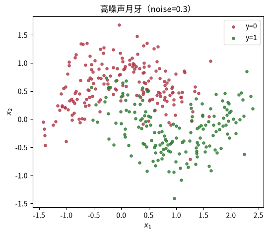

---
title: 集成学习：Bagging 与随机森林
published: 2026-08-15
description: 单棵决策树高方差，集成思想让很多「又笨又抖」的模型投票抵消方差。本课从 Bootstrap 采样实现 Bagging，理解随机森林的特征子采样、OOB 验证与特征重要性。
tags: [机器学习, 集成学习, 随机森林, Bagging]
category: 机器学习
draft: false
prevTitle: "Boosting 提升方法：串行纠错"
prevSlug: "机器学习/0010-boosting提升方法"
nextTitle: "SVM：一条有「间隔」的直线"
nextSlug: "机器学习/0008-支持向量机svm"
---

# 集成学习：Bagging 与随机森林

这是机器学习系列课程笔记的第 9 课，前置课程是 0007（决策树）与 0005（偏差-方差）。单棵决策树高方差：数据抖一抖，树就换一棵。本课的核心思想是**集成**：把很多「又笨又抖」的模型放一起投票，让它们的方差互相抵消。这堂课的产物——**随机森林**，是面试最高频的模型之一。

## 一、知识点

### 为什么要集成：偏差-方差分解

泛化误差 ≈ 偏差² + 方差 + 噪声。单棵深树偏差低但方差高。Bagging 的洞察：

$$\text{对 } m \text{ 个独立、同分布的模型求平均：方差 } \to \frac{\text{方差}}{m} \text{，偏差不变}$$

模型独立难，但用**自助采样（bootstrap）**让每棵树看不同的训练子集，就是近似的独立。

### 三要素

- **模型**：一组决策树的集成，预测时多数投票（分类）/ 平均（回归）。
- **策略**：每棵树在自助采样子集上训练；随机森林再加一层随机：分裂时只看随机特征子集。
- **算法**：Bootstrap 采样 → 逐树贪心生长 → 投票；每棵树的随机源独立（random_state）。

### 两个关键组件

**1. Bootstrap（自助采样）。** 从 N 个样本里有放回地抽 N 次。每个样本约 **63.2%** 概率被抽到（$1 - 1/e$），没被抽到的约 36.8% 构成天然的验证集——叫 **OOB（袋外）样本**，可直接用来估泛化误差，不用额外切验证集。

**2. 特征子采样（随机森林的灵魂）。** 如果所有树都用全部特征，那么「最强的那个特征」每棵树都第一个用它分裂——树之间高度相关，投票抵消不了方差。随机森林让每棵树分裂时只从 **$\sqrt{p}$**（分类）个随机特征里选，树之间更独立，集成效果更好。这是随机森林 vs 普通 Bagging 的本质区别。

### 三个必懂点

**1. 为什么能「降方差」而不升偏差。** 每棵树本身偏差没变（还是那类树），只是互相独立后平均消掉了方差。所以集成对「高方差」模型（深树、kNN）最有效；对低方差模型（线性回归）帮助有限。

**2. 偏差低：几乎不用调深，调树数。** 随机森林的树通常长满（`max_depth=None`），靠随机性而非剪枝来防过拟合。`n_estimators` 越多越稳（有收敛上限），几乎不会过拟合。

**3. 特征重要性：这次的统计更可信。** 随机森林的特征重要性（`feature_importances_`）仍可能被高相关特征稀释，但比单棵树稳得多，是特征筛选的常用起点。更严谨的是「排列重要性」（permutation importance）。

### 推荐阅读

- ISL 第 8 章（Tree-Based Methods）——Bagging、随机森林、OOB 误差的完整讲解，数学不重但直觉到位。[statlearning.com](https://www.statlearning.com/)。
- 李航《统计学习方法》§8.3 随机森林——随机森林的定义与两种随机性的严格表述。[豆瓣页面](https://book.douban.com/subject/33437381/)。

---

## 二、动手实践

配套 notebook：`practice/0009_ensemble.ipynb`，从零实现 Bagging 并对比随机森林。

### 问题设定：咬合的月牙（noise 高）

noise=0.3 的月牙数据上，单棵深树 train≈1.0 但 test 差——典型高方差。看集成能不能救。

```python
import numpy as np
import matplotlib.pyplot as plt
from sklearn.datasets import make_moons
from sklearn.model_selection import train_test_split

X, y = make_moons(n_samples=500, noise=0.3, random_state=0)
Xtr, Xte, ytr, yte = train_test_split(X, y, test_size=0.3, random_state=0)
print("train:", Xtr.shape, "test:", Xte.shape)

plt.figure(figsize=(6, 5))
plt.scatter(Xtr[ytr == 0, 0], Xtr[ytr == 0, 1], c="#b23a48", s=14, alpha=0.8, label="y=0")
plt.scatter(Xtr[ytr == 1, 0], Xtr[ytr == 1, 1], c="#2e7d32", s=14, alpha=0.8, label="y=1")
plt.xlabel("$x_1$"); plt.ylabel("$x_2$"); plt.legend(); plt.title("高噪声月牙（noise=0.3）")
plt.show()
```



噪声比 0007 更大，单棵树很容易把噪声也「背下来」。

### Bootstrap：自助采样

有放回地抽 N 次。每个样本被抽到的概率 $1 - (1-1/N)^N \to 1 - 1/e \approx 63.2\%$，所以约 **36.8% 抽不到**——这些是袋外（OOB）样本。先写一个 bootstrap 采样函数验证这个比例。

```python
def bootstrap_indices(rng, n):
    """有放回地抽 n 个索引。返回 (被抽中集合, 袋外索引)。"""
    idx = rng.integers(0, n, size=n)
    in_bag = np.unique(idx)
    oob = np.setdiff1d(np.arange(n), in_bag)        # 求两数组的差集
    return idx, oob

rng = np.random.default_rng(0)
_, oob = bootstrap_indices(rng, 10000)
print("袋外比例：", round(len(oob) / 10000, 4), "（理论约 0.368）")
```

实际算出来的袋外比例与理论值 36.8% 高度吻合。

### 从零实现 Bagging

流程：bootstrap 抽子集 → 每棵深树长满 → 预测时多数投票。这里复用 sklearn 的无剪枝深树。

```python
from sklearn.tree import DecisionTreeClassifier

def fit_bagging(X, y, n_trees=50, max_features=None, seed=0):
    """返回 (树列表, 每棵树的 OOB 索引列表)。max_features=None 则用全部特征（纯 Bagging）。"""
    rng = np.random.default_rng(seed)
    n = len(X)
    trees, oobs = [], []
    for t in range(n_trees):
        idx, oob = bootstrap_indices(rng, n)
        tree = DecisionTreeClassifier(random_state=t)  # 深树，不剪枝
        tree.fit(X[idx], y[idx])
        trees.append(tree)
        oobs.append(oob)
    return trees, oobs

def predict_bagging(trees, X):
    """多数投票。"""
    votes = np.vstack([tree.predict(X) for tree in trees])  # (n_trees, n_test)
    return np.array([np.bincount(v.astype(int)).argmax() for v in votes.T])

trees, oobs = fit_bagging(Xtr, ytr, n_trees=50)
print("单棵树 test 平均：", round(float(np.mean([t.score(Xte, yte) for t in trees])), 3))
print("Bagging 投票 test：", round(float(np.mean(predict_bagging(trees, Xte) == yte)), 3))
```

Bagging 的投票结果明显好于单棵树的平均——多棵高方差树的预测互相抵消，集体决策更稳。

### 随机森林：再加一层「特征随机」

所有树都用全部特征时，最强特征被每棵树第一个用 → 树高度相关，抵消不了方差。随机森林分裂时只从 $\sqrt{p}$ 个随机特征里选（sklearn 的 `max_features='sqrt'`），树之间更独立。

```python
from sklearn.ensemble import RandomForestClassifier

single = DecisionTreeClassifier(random_state=0).fit(Xtr, ytr)
rf = RandomForestClassifier(n_estimators=200, random_state=0).fit(Xtr, ytr)     # 分类任务默认 sqrt
rf_full = RandomForestClassifier(n_estimators=200, max_features=None, random_state=0).fit(Xtr, ytr)

print("单棵深树  train/test：", round(single.score(Xtr, ytr), 3), round(single.score(Xte, yte), 3))
print("Bagging(全特征) train/test：", round(rf_full.score(Xtr, ytr), 3), round(rf_full.score(Xte, yte), 3))
print("随机森林   train/test：", round(rf.score(Xtr, ytr), 3), round(rf.score(Xte, yte), 3))
```

单棵深树 train 接近 1.0、test 明显更差；加入特征子采样后（随机森林），train 略降、test 反而最好——特征随机让树之间更独立，抵消方差更有效。

### OOB 分数：不切验证集也能估误差

sklearn 的 `oob_score` 用每棵树的袋外样本估它的误差再平均——结果和交叉验证非常接近，省去切验证集的麻烦。

```python
rf_oob = RandomForestClassifier(n_estimators=200, oob_score=True, random_state=0).fit(Xtr, ytr)
print("OOB 分数：", round(rf_oob.oob_score_, 3))
print("test 准确率：", round(rf_oob.score(Xte, yte), 3))
print("（两者接近 → OOB 是免费且可信的验证）")
```

OOB 分数与测试准确率非常接近——这就是 36.8% 袋外样本的价值：免费的验证集。

### 特征重要性（真实数据）

乳腺癌数据集（30 个特征）上，随机森林给每个特征打分——比单棵树的统计稳得多，是特征筛选的常用起点。

```python
from sklearn.datasets import load_breast_cancer

bc = load_breast_cancer()
Xb_tr, Xb_te, yb_tr, yb_te = train_test_split(bc.data, bc.target, test_size=0.3, random_state=0)

rf_b = RandomForestClassifier(n_estimators=300, random_state=0).fit(Xb_tr, yb_tr)
print("乳腺癌 单树 test：", round(DecisionTreeClassifier(random_state=0).fit(Xb_tr, yb_tr).score(Xb_te, yb_te), 3))
print("乳腺癌 RF   test：", round(rf_b.score(Xb_te, yb_te), 3))

imp = rf_b.feature_importances_
top = np.argsort(imp)[::-1][:5]
print("\nTop-5 特征：")
for i in top:
    print(f"  {bc.feature_names[i]:<28} {imp[i]:.3f}")
```

在 30 个特征的真实数据上，随机森林依然显著优于单棵树，并给出一个更可信的特征重要性排名。

---

## 三、练习

练习分三档：S 理解 / M 动手 / H 挑战。答案折叠在下方，先自己动手再对答案。

### S1. 验证袋外比例收敛到 36.8%

题目描述：用 `bootstrap_indices` 做多次实验：`n=50, 200, 2000`，各跑 100 次统计袋外比例的平均值，验证它收敛到 36.8%。

<details>
<summary>答案</summary>
<p>由 $1 - (1-1/N)^N \to 1 - 1/e \approx 63.2\%$ 被抽到，袋外比例收敛到 $1/e \approx 36.8\%$。n 越大、实验次数越多，均值越接近 0.368。</p>
</details>

### S2. 随机森林为什么「故意」不背训练集却更好？

题目描述：单棵深树 train=1.0 而随机森林 train≈0.99，结合「降方差」解释为什么。

<details>
<summary>答案</summary>
<p>单棵树可以完全拟合训练集，但树之间预测不完全对齐，集成后不会完全复刻训练集输出，训练集略降，但测试集变好——多棵树平均掉了彼此的高方差，泛化更稳。</p>
</details>

### M1. 扫 n_estimators

题目描述：把 `n_estimators` 从 1 扫到 200，画 Bagging test 准确率随树数变化的曲线，看它什么时候「收敛」，之后再加树还有没有用。

<details>
<summary>答案</summary>
<p>Bagging 不会因为树太多而过拟合！增加树不会损害测试集，只是收益饱和。曲线会先快速上升，随后趋于平稳（收敛），再加树只是增加计算量、不再明显提升。</p>
</details>

### M2. 对比单树 / Bagging 全特征 / 随机森林

题目描述：对比三者的 test 准确率：单树 / Bagging 全特征 / 随机森林（√p 特征），用数字说明「特征子采样」到底贡献了多少提升。

<details>
<summary>答案</summary>
<p>可参考上文「随机森林：再加一层特征随机」的运行结果：单树最差、纯 Bagging（全特征）居中、随机森林（√p 特征）最好。特征子采样降低树之间的相关性，让投票能更有效地抵消方差。</p>
</details>

### H1. 对比单树 vs 随机森林的决策边界

题目描述：在月牙数据上画出单棵深树 vs 随机森林的决策边界并排对比，观察随机森林边界为什么更平滑。

<details>
<summary>答案</summary>
<p>多棵树的轴平行边界叠加投票，碎齿互相抵消，集成后的边界更平滑、更贴近真实的月牙形状；单棵深树则会过拟合噪声、边界碎成锯齿。</p>
</details>

### H2. 面试题：为什么说「随机森林对高方差模型有效、对低方差模型帮助有限」？

题目描述：如果你把线性回归做 Bagging，测试准确率会明显提升吗？（可以实际试一下：`RandomForestRegressor` 或对逻辑回归做 Bagging。）

<details>
<summary>答案</summary>
<p>把线性回归做 Bagging，测试准确率不会明显提升。线性回归本身是低方差高偏差模型，Bagging 不改善偏差；基模型之间相关性很高，没法有效降方差。集成只对「高方差」模型（深树、kNN）最有效。</p>
</details>

---

## 四、测验

### 测验 1

问题：Bagging 主要通过什么降低泛化误差？

选项：A. 降低偏差 / B. 增加噪声 / C. 减少样本 / D. 降低方差 ✓

<details>
<summary>答案与解析</summary>
<p><strong>答案：D</strong>。独立模型平均后方差/m、偏差不变——专治高方差模型。</p>
</details>

### 测验 2

问题：自助采样里，每个样本大约多少概率抽不到？

选项：A. 10% / B. 50% / C. 5% / D. 36.8% ✓

<details>
<summary>答案与解析</summary>
<p><strong>答案：D</strong>。1−1/e ≈ 63.2% 被抽到，约 36.8% 是袋外样本。</p>
</details>

### 测验 3

问题：随机森林和普通 Bagging 的本质区别？

选项：A. 树更深 / B. 更多树 / C. 数据更多 / D. 分裂时特征子采样 ✓

<details>
<summary>答案与解析</summary>
<p><strong>答案：D</strong>。分裂只看随机特征子集，让树之间更独立，抵消方差更有效。</p>
</details>

### 测验 4

问题：袋外（OOB）样本可以用来？

选项：A. 训练模型 / B. 增加特征 / C. 提升偏差 / D. 估计泛化误差 ✓

<details>
<summary>答案与解析</summary>
<p><strong>答案：D</strong>。每棵树没见过的样本组成天然验证集，OOB 分数≈交叉验证。</p>
</details>

---

## 五、小结

集成学习的核心是用「平均」换「稳定」：Bagging 靠自助采样制造近似的独立模型，把高方差树的误差平均掉；随机森林再加一层特征子采样，让树之间更独立。树不用剪枝、越加越多也只是收益饱和，几乎不会过拟合——OOB 还能免费估误差。与 SVM 的「少数派」思路相反，集成走的是「团结多数」路线，而下一课 Boosting 将把「平均」升级为「串行纠错」。
| [← 上一课](/my-blog/posts/机器学习/0010-boosting提升方法/) | [课程目录](/my-blog/posts/机器学习/0001-机器学习全景与学习路线图/) | [下一课 →](/my-blog/posts/机器学习/0008-支持向量机svm/) |
