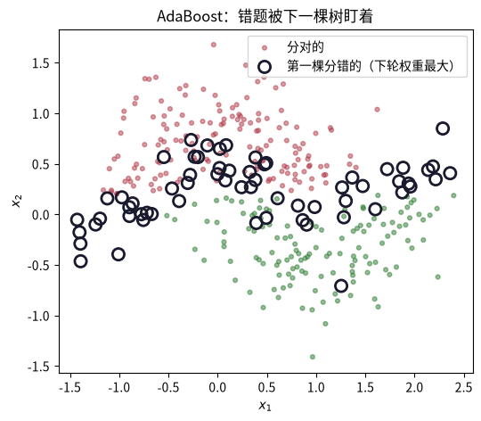
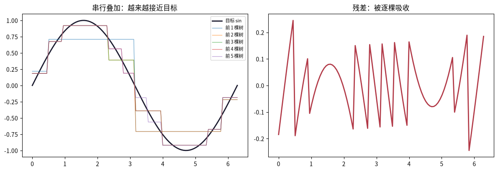

# Boosting 提升方法：串行纠错

这是机器学习系列课程笔记第 10 课。前置知识：课程 0009（Bagging 集成学习）+ 课程 0007（决策树）。上一课 Bagging 靠并行投票降方差，Boosting 换一个完全相反的思路——**串行地「纠错」**：每棵树都盯着前一棵树犯的错。AdaBoost 给错误样本加权，GBDT 直接拟合残差，而 GBDT 正是 XGBoost、LightGBM 这些竞赛常胜军的祖先。

## 一、知识点

### Bagging vs Boosting：一张表

| | Bagging | Boosting |
| --- | --- | --- |
| 构建 | 并行，互不依赖 | 串行，逐棵依赖 |
| 侧重 | 降方差（深模型有效） | 降偏差（弱模型有效） |
| 样本 | bootstrap 随机子集 | 加权：错得多权重高 |
| 代表 | 随机森林 | AdaBoost、GBDT、XGBoost |

### AdaBoost：给「错误样本」加权重

关键观察：**树桩（max_depth=1）太弱，单棵 test 只有约 80%**。AdaBoost 把它串起来：

1. 初始化：每个样本等权重 1/N。
2. 每轮：用带权数据训练一个树桩，计算加权错误率 ε。
3. 给该树桩分配话语权：

$$\alpha = \frac{1}{2}\ln\frac{1-\varepsilon}{\varepsilon}$$

4. 更新样本权重：**分错的样本权重 × e^α，分对的 × e^−α**，再归一化——让下一棵树更关注被搞错的样本。
5. 预测：所有树桩按 α 加权投票。

这样把一堆「略好于瞎猜」的树桩，叠成一个强分类器——这正是「弱学习器提升为强学习器」的 AdaBoost（Adaptive Boosting）名字由来。

**α 的推导（指数损失）**。AdaBoost 优化的是指数损失：

$$\mathcal{L} = \sum_i w_i \exp\big(-y_i \alpha h_m(x_i)\big)$$

其中 $h_m(x_i), y_i \in \{+1,-1\}$：分类正确时 $y_i h_m(x_i)=+1$，分类错误时为 $-1$。把求和拆成分类正确集合 $S_{\text{right}}$ 与错分集合 $S_{\text{wrong}}$，并定义带权错误率 $\mathrm{err}_m=\sum_{i\in S_{\text{wrong}}} w_i$，损失可化为：

$$\mathcal{L}(\alpha) = (1-\mathrm{err}_m)e^{-\alpha} + \mathrm{err}_m\,e^{\alpha}$$

对 $\alpha$ 求导并令其为零：

$$\frac{d\mathcal{L}}{d\alpha} = -(1-\mathrm{err}_m)e^{-\alpha} + \mathrm{err}_m\,e^{\alpha} = 0 \;\Longrightarrow\; e^{2\alpha} = \frac{1-\mathrm{err}_m}{\mathrm{err}_m} \;\Longrightarrow\; \alpha_m = \frac{1}{2}\ln\frac{1-\mathrm{err}_m}{\mathrm{err}_m}$$

几个直观结论：

1. $err_m$ 越小（基分类器效果越好），$\alpha_m$ 越大，该基学习器在集成中话语权越高。
2. 当 $err_m = 0.5$ 时 $\alpha_m = 0$，相当于这个弱分类器完全没用，直接舍弃。
3. $err_m > 0.5$ 时 $\alpha_m < 0$，说明分类效果比随机猜还差，等价于把 $h_m$ 的预测结果取反再使用。

注意：该损失是指数损失而非 0-1 损失，最小化指数损失间接降低分类错误。

### GBDT：不是加权，而是拟合残差

GBDT 换一种纠错方式：第 m 棵树直接拟合「前 m−1 棵树的预测与真实值的**残差**」：

$$r_i = y_i - \hat{y}_i^{\,(m-1)}$$

- 每棵新树都在修「上一位犯的错」，串行叠加后偏差被压得很低。
- **梯度提升**的称呼来源：拟合残差 = 对损失函数做一步梯度下降。回归用均方误差的残差，分类用对数损失。
- XGBoost 就是 GBDT 加二阶梯度 + 正则化 + 工程优化。

### 三个必懂点

1. **Boosting 降偏差，但要防过拟合**。Bagging 几乎不会过拟合；Boosting 会——树多、树深都推高复杂度，`n_estimators` 和 `max_depth`（或学习率 `learning_rate`）要调。这是它与 Bagging 最关键的行为差异。
2. **学习率 = 每棵树走多小一步**。`learning_rate`（收缩因子）压小每棵树的贡献，让整体更稳；代价是要更多树。规则：**learning_rate 小 → n_estimators 大**。
3. **对「弱学习器」最有效**。Bagging 要深树（方差大才能降），Boosting 要弱树（树桩、浅树）串起来降偏差。用浅树是 GBDT 的标准配置。

### 推荐阅读

> - **ISL 第 8 章（Boosting）**——AdaBoost 的加权直觉、GBDT 残差拟合与收缩因子。[statlearning.com](https://www.statlearning.com/)。
> - **李航《统计学习方法》§8 提升方法**——AdaBoost 的「前向分步算法」视角与误差界推导。[豆瓣页面](https://book.douban.com/subject/33437381/)。

### 下一步

做完练习记得回答：M2 里 AdaBoost 加树到 200 后 test 是持平还是下降？下一课离开有监督，进入**聚类（K-Means）**——第一次处理「没有标签」的数据。

## 二、动手实践

### 数据与基准线：月牙（noise=0.3）

沿用 0009 的数据。先看单棵树的基准线：树桩（max_depth=1）只有约 80%——「弱学习器」正是本课的主角。

```python
import numpy as np
import matplotlib.pyplot as plt

from sklearn.datasets import make_moons
from sklearn.model_selection import train_test_split
from sklearn.tree import DecisionTreeClassifier

X, y = make_moons(n_samples=500, noise=0.3, random_state=0)
Xtr, Xte, ytr, yte = train_test_split(X, y, test_size=0.3, random_state=0)

stump = DecisionTreeClassifier(max_depth=1, random_state=0).fit(Xtr, ytr)
deep = DecisionTreeClassifier(random_state=0).fit(Xtr, ytr)
print("树桩(max_depth=1)  train/test：", round(stump.score(Xtr, ytr), 3), round(stump.score(Xte, yte), 3))
print("深树              train/test：", round(deep.score(Xtr, ytr), 3), round(deep.score(Xte, yte), 3))
```

### 手写 AdaBoost：四个步骤循环

带权训练树桩 → 算加权错误率 ε → 话语权 α = ½·ln((1−ε)/ε) → 更新样本权重（分错 ×e^α，分对 ×e^−α）。

```python
def to_pm(y):
    """标签 0/1 → ±1。"""
    return np.where(y == 0, -1.0, 1.0)

def fit_adaboost(X, y, M=80):
    """手写 AdaBoost：返回 (树列表, 权重列表)。"""
    ypm = to_pm(y)      # 转为 ±1 标签
    n = len(y)
    w = np.ones(n) / n
    models, alphas = [], []
    for m in range(M):  # 循环M次
        h = DecisionTreeClassifier(max_depth=1, random_state=m).fit(X, y, sample_weight=w)
        pred = to_pm(h.predict(X))      # 预测结果 ±1
        err = np.sum(w * (pred != ypm)) / w.sum()   # 计算加权错误率
        if err >= 0.5 or err < 1e-6:
            break
        alpha = 0.5 * np.log((1 - err) / err)   # 错误率小则 alpha 大，权重大
        w = w * np.exp(-alpha * ypm * pred)     # 分错加权，分对降权
        w = w / w.sum()
        models.append(h); alphas.append(alpha)
    return models, alphas

def predict_adaboost(models, alphas, X):
    s = np.zeros(len(X))
    for h, a in zip(models, alphas):
        s += a * to_pm(h.predict(X))
    return (s >= 0).astype(int)

models, alphas = fit_adaboost(Xtr, ytr, M=80)
print("手写 AdaBoost 树数：", len(models))
print("手写 AdaBoost test：", round(float(np.mean(predict_adaboost(models, alphas, Xte) == yte)), 3))
print("单棵树桩       test：", round(stump.score(Xte, yte), 3))
```

### sklearn 版 + 权重演变可视化

用 sklearn 的 `AdaBoostClassifier` 对比（结果应一致），并画出第一棵树分错的样本——它们下一轮权重最大。

```python
from sklearn.ensemble import AdaBoostClassifier

ada = AdaBoostClassifier(estimator=DecisionTreeClassifier(max_depth=1),
                         n_estimators=80, random_state=0).fit(Xtr, ytr)
print("sklearn AdaBoost test：", round(ada.score(Xte, yte), 3))

# 第一棵树的误分类点（下一轮权重最大的样本）
h0 = models[0]
mis = to_pm(h0.predict(Xtr)) != to_pm(ytr)      # 找到第一棵树分错的样本
plt.figure(figsize=(6, 5))
plt.scatter(Xtr[~mis, 0], Xtr[~mis, 1], c=[["#b23a48", "#2e7d32"][v] for v in ytr[~mis]], s=12, alpha=0.5, label="分对的")
plt.scatter(Xtr[mis, 0], Xtr[mis, 1], c="none", edgecolors="#1a1a2e", s=90, lw=2, label="第一棵分错的（下轮权重最大）")
plt.legend(); plt.xlabel("$x_1$"); plt.ylabel("$x_2$"); plt.title("AdaBoost：错题被下一棵树盯着")
plt.show()
```



*图：第一棵树分错的样本用空心大圈标出，它们的权重在下一轮被放大，成为下一棵树的重点。*

### GBDT：拟合残差

AdaBoost 靠权重让下一棵树「更关注错题」；GBDT 更直接——让下一棵树去**预测残差**（y − 已有预测）。用回归演示最直观：一棵一棵地去逼近一条曲线。

```python
from sklearn.tree import DecisionTreeRegressor

# 目标：sin 曲线
X1 = np.linspace(0, 2 * np.pi, 100)
y1 = np.sin(X1)

residual = y1.copy()          # 初始残差 = 目标本身
trees = []
for m in range(5):
    t = DecisionTreeRegressor(max_depth=2, random_state=m).fit(X1[:, None], residual)
    trees.append(t)
    residual = residual - t.predict(X1[:, None])   # 下一棵拟合剩下的残差

step = np.zeros_like(y1)
fig, axes = plt.subplots(1, 2, figsize=(12, 4.2))
axes[0].plot(X1, y1, color="#1a1a2e", lw=2, label="目标 sin")
for m in range(5):
    step = step + trees[m].predict(X1[:, None])
    axes[0].plot(X1, step, lw=1, alpha=0.6, label=f"前 {m+1} 棵树")
axes[0].legend(fontsize=8); axes[0].set_title("串行叠加：越来越接近目标")
axes[1].plot(X1, residual, color="#b23a48", lw=2, label="最终残差（只剩噪声）")
axes[1].set_title("残差：被逐棵吸收")
plt.tight_layout(); plt.show()
```



*图：5 棵浅树串行叠加逐步逼近 sin 曲线，最终残差只剩噪声。相当于系统的串联：上一棵树的残差作为下一棵树 y 的目标值。*

### 分类上的 GBDT：完整对比

回到月牙分类。对比全部模型，注意 Boosting 家族用「浅树」，而随机森林用「深树」。

```python
from sklearn.ensemble import GradientBoostingClassifier, RandomForestClassifier

rf = RandomForestClassifier(n_estimators=200, random_state=0).fit(Xtr, ytr)
gbdt1 = GradientBoostingClassifier(n_estimators=100, max_depth=1, random_state=0).fit(Xtr, ytr)
gbdt3 = GradientBoostingClassifier(n_estimators=100, max_depth=3, random_state=0).fit(Xtr, ytr)
gbdt5 = GradientBoostingClassifier(n_estimators=100, max_depth=5, random_state=0).fit(Xtr, ytr)

for name, m in [("树桩", stump), ("深树", deep), ("随机森林", rf),
                ("AdaBoost", ada), ("GBDT depth=1", gbdt1), ("GBDT depth=3", gbdt3), ("GBDT depth=5", gbdt5)]:
    print(f"{name:14s} train {m.score(Xtr, ytr):.3f}  test {m.score(Xte, yte):.3f}")
```

## 三、练习

### S1. 为什么分错的样本权重会变大？

为什么分错的样本权重会变大？这个「针对性」和 Bagging 的「一视同仁」有什么本质区别？结合「降偏差 vs 降方差」回答。

<details>
<summary>答案</summary>
<p>每一轮训练完，分类错误的样本会增大样本权重，分对的样本降低权重。下一棵弱分类器会被迫更加关注这些被搞错的样本，努力修正之前的错误。</p>
<p>AdaBoost 提高错分样本权重，让下一个弱学习器重点攻克难样本，串行迭代降低偏差；Bagging 每棵树对样本无差别对待，并行训练，依靠平均来降低方差。</p>
</details>

### S2. GBDT 残差演示里继续加树会发生什么？

GBDT 拟合残差的演示里，前 3 棵树叠加后曲线已经贴近 sin——如果继续加到 20 棵会发生什么？为什么？

<details>
<summary>答案</summary>
<p>会发生过拟合。Boosting 是串行迭代，迭代轮次过多会过拟合：残差被吸收完后，后续树开始去拟合训练噪声，曲线反而不如少数几棵时平滑。</p>
</details>

### M1. 扫树数画 AdaBoost test 曲线

把 `fit_adaboost` 的 `M` 从 1 扫到 200，画 AdaBoost test 准确率曲线。它和随机森林（0009 的 M1）收敛后「持平」的行为一样吗？

<details>
<summary>答案</summary>
<p>不一样。Bagging 并行平均，增加基模型不会引入过拟合，随机森林收敛后基本持平；Boosting 串行迭代，迭代轮次过多会过拟合——AdaBoost 的 test 曲线在到达峰值后会下降。</p>
</details>

### M2. 扫 learning_rate

把 `learning_rate` 从 0.01 扫到 1（固定 n_estimators=100），看 GBDT test 准确率变化，解释「学习率小 → 需要更多树」的权衡。

<details>
<summary>答案</summary>
<p>learning_rate（收缩因子）压小每棵树的贡献，让整体更稳，代价是要更多树。固定树数时，学习率太小 → 每棵树走得太小，拟合不足（欠拟合）；学习率太大 → 走得太大，容易过拟合。规则：learning_rate 小 → n_estimators 大。</p>
</details>

### H1. GBDT 的 max_depth 与过拟合

把 GBDT 的 `max_depth` 从 1 调到 5（固定 n_estimators=100），打印 train/test 准确率。树变深后 train/test 差距如何变化？这说明 GBDT 会过拟合吗？

<details>
<summary>答案</summary>
<p>GBDT 是会发生过拟合的。基树本身越复杂（越深），单棵树方差越高；串行叠加，更容易记住训练噪声。所以 GBDT 实践中要限制树深度，配合学习率、正则抑制过拟合。</p>
</details>

### H2. 面试题：XGBoost 相比 GBDT 做了哪几件事？

面试题：XGBoost 相比 GBDT 做了哪几件事？（提示：二阶梯度、正则化、缺失值处理、列采样等）用一句话概括它为什么比赛常胜。

<details>
<summary>答案</summary>
<p>XGBoost 在 GBDT 一阶梯度基础上引入二阶梯度，增加丰富正则（如 L1、L2 正则化），内置缺失值处理、行列采样，加上工程优化，精度高、抗过拟合能力强，所以竞赛表现优异。</p>
</details>

## 四、测验

### 测验 1

问题：Boosting 与 Bagging 最大的区别？

选项：A. 并行与串行的树 / B. 更深的树 / C. 更少的树 / D. 逐棵纠错

<details>
<summary>答案与解析</summary>
<p><strong>答案：D</strong>。Boosting 串行，每棵学前一棵的残差/错题；Bagging 并行独立。</p>
</details>

### 测验 2

问题：AdaBoost 分错样本的权重会怎样？

选项：A. 减小 / B. 清零 / C. 不变 / D. 变大

<details>
<summary>答案与解析</summary>
<p><strong>答案：D</strong>。分错的样本权重 ×e^α，下一棵树更关注它们。</p>
</details>

### 测验 3

问题：GBDT 每棵新树拟合的是？

选项：A. 原始标签 / B. 随机噪声 / C. 特征均值 / D. 残差

<details>
<summary>答案与解析</summary>
<p><strong>答案：D</strong>。拟合 y − 已有预测的残差，串行叠加压低偏差。</p>
</details>

### 测验 4

问题：与随机森林相比，Boosting 更需要注意？

选项：A. 特征缩放 / B. 数据清洗 / C. 缺失值 / D. 过拟合

<details>
<summary>答案与解析</summary>
<p><strong>答案：D</strong>。Boosting 会过拟合，树数/深度/学习率都要调。</p>
</details>

## 五、小结

Boosting 与 Bagging 是集成学习的一体两面：一个靠并行平均降方差，一个靠串行纠错降偏差。AdaBoost 用指数损失推导出清晰的加权规则，GBDT 则把纠错简化为拟合残差。但降偏差的代价是过拟合风险——这正是「偏差-方差」权衡在集成学习里的又一次体现，也解释了为什么 GBDT 必须配浅树、小学习率和正则化。下一课将离开有监督，进入无监督聚类。