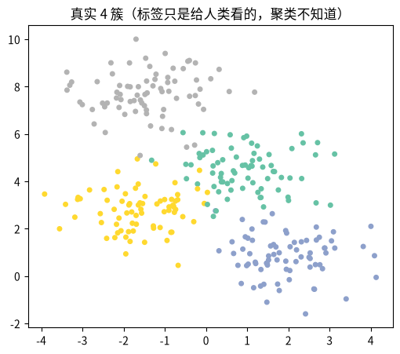
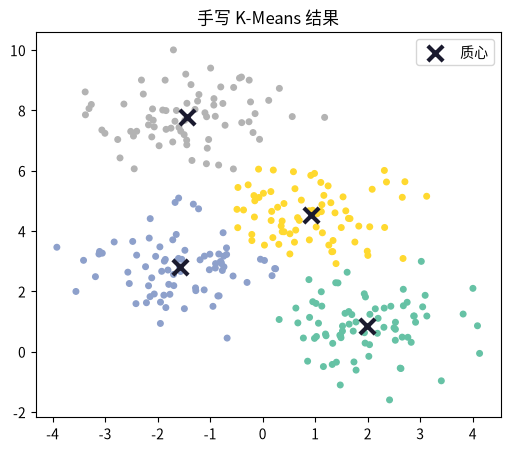
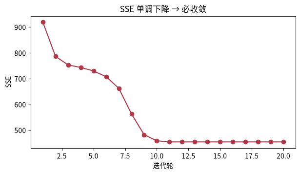
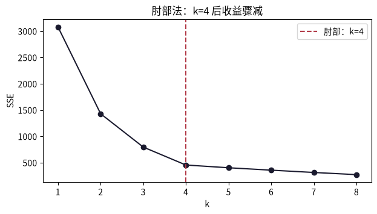
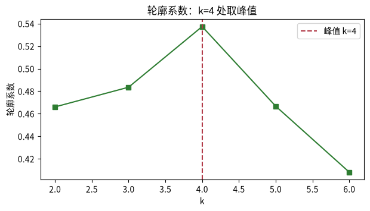
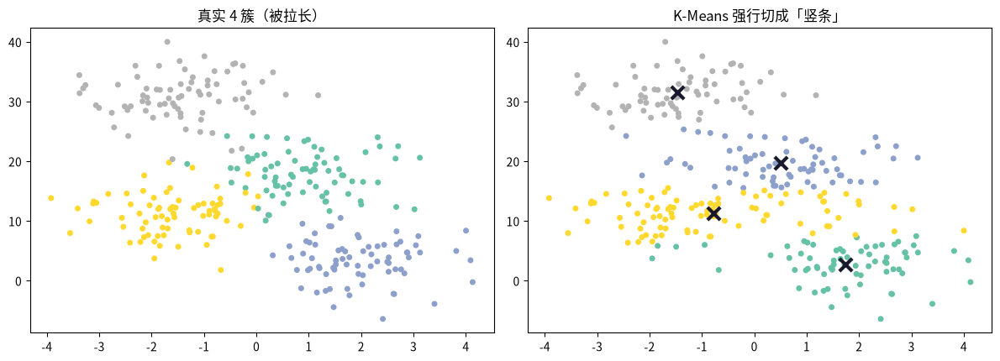

---
title: K-Means 聚类
published: 2026-08-17
description: 机器学习课程第 11 课：首个无监督算法 K-Means 聚类，含 Lloyd 迭代手写实现、SSE 收敛验证、肘部法/轮廓系数选 k 与练习测验。
tags: [机器学习, K-Means, 聚类, 无监督学习]
category: 机器学习
draft: false
prevTitle: "PCA 降维：找数据最「伸展」的方向"
prevSlug: "机器学习/0012-pca降维"
nextTitle: "Boosting 提升方法：串行纠错"
nextSlug: "机器学习/0010-boosting提升方法"
---

# K-Means 聚类

这是机器学习系列课程笔记第 11 课。前置知识：课程 0003（距离）+ 课程 0006（生成式）。前 10 课全是**有监督**学习（有标签，学「输入 → 标签」的映射）；这一课进入**无监督**：只有数据，没有标签，让算法自己发现「这堆数据里有几个团」。K-Means 是最经典的聚类算法，面试必考——把数据分成 k 组，让「同组尽量近，异组尽量远」。

## 一、知识点

### 三要素（无监督版）

- **模型**：k 个质心；每个样本属于「最近的质心」那一组（Voronoi 划分）。
- **策略**：最小化类内平方和（SSE）：每个样本到所属质心的距离平方之和。

$$\mathrm{SSE} = \sum_{i=1}^k \sum_{x \in C_i} \|x - \mu_i\|^2$$

- **算法**：迭代两步——①分配：每个点归到最近质心；②更新：质心挪到组内均值。交替直到收敛。

### 算法：Lloyd 迭代

```
1. 初始化：随机挑 k 个样本当质心
2. 重复：
   a. 分配：每个点 → 最近质心的类
   b. 更新：每个质心 = 组内均值
   直到质心不再移动（或达到轮数上限）
```

关键性质：**每步都让 SSE 单调不增**，所以必收敛。但只保证收敛到「局部最优」——初始化不同，结果可能不同，所以要多次随机初始化取最好。

### 三个必懂点

1. **k 怎么定：肘部法 + 轮廓系数**
   - **肘部法**：画 SSE ~ k 曲线，找「拐点」——k 再大收益骤减的那个点。
   - **轮廓系数**：每个样本算「与自己组内 vs 与最近异组」的接近度，全样本平均 ∈ [−1, 1]，越大越好。取峰值对应的 k。
   - 没有「正确」的 k——它是**超参数**，取决于你想多细地看数据。
2. **对「形状」敏感：只认圆形簇**。K-Means 用欧氏距离，天然偏向「大小相近、各向同性的圆团」。拉伸的长条簇、嵌套的圆环、大小悬殊的簇它都分不好。这是它最大的局限，也是为什么真实数据常用更柔的算法（GMM、DBSCAN）。
3. **它是在解一个 NP 难问题的近似**。「找全局最优的 k 质心」是 NP 难的；Lloyd 迭代是贪心近似，只保证局部最优。所以 `n_init`（多次随机起点）很重要。

### 推荐阅读

> - **ISL 第 12 章（Unsupervised Learning）**——K-Means 的细节、K 的选择、与层次聚类的对比。[statlearning.com](https://www.statlearning.com/)。
> - **李航《统计学习方法》§14.1 聚类**——聚类的距离度量与 k 均值算法的形式化表述。[豆瓣页面](https://book.douban.com/subject/33437381/)。

### 下一步

做完练习记得回答：H1 里拉长簇失败的根子你判断在「模型」还是「算法」？下一课 **PCA（降维）**——不是分组，而是找数据「最长的几个方向」压缩维度。

## 二、动手实践

### 问题设定：四团数据

我们『作弊』地知道真实有 4 个簇（其实无监督时不知道）——用它来验证算法能不能找回真相。

```python
import numpy as np
import matplotlib.pyplot as plt

from sklearn.datasets import make_blobs

X, y_true = make_blobs(n_samples=300, centers=4, cluster_std=0.9, random_state=0)
print("X:", X.shape, "真实簇数:", len(np.unique(y_true)))

plt.figure(figsize=(6, 5))
plt.scatter(X[:, 0], X[:, 1], c=y_true, cmap="Set2", s=16)
plt.title("真实 4 簇（标签只是给人类看的，聚类不知道）")
plt.show()
```



*图：四个分离良好的圆簇，真实标签仅供人类验证，聚类算法并不知道。*

### 手写 K-Means（Lloyd 迭代）

三步：随机初始化 k 个质心 → 循环「分配」（点到最近质心）→「更新」（质心=组内均值）。返回 (标签, 质心)。

```python
def kmeans(X, k, iters=50, seed=0):
    """手写 K-Means。返回 (labels, centers)。"""
    rng = np.random.default_rng(seed)
    idx = rng.choice(len(X), k, replace=False)
    centers = X[idx].copy()
    for _ in range(iters):
        d = ((X[:, None, :] - centers[None, :, :]) ** 2).sum(-1)   # (n, k) 距离平方，k是质心个数
        labels = d.argmin(1)                                        # 分配：最近质心
        new = np.array([
            X[labels == j].mean(0) if (labels == j).any() else centers[j]
            for j in range(k)
        ])  # 更新k个质心
        if np.allclose(new, centers):                               # 收敛
            break
        centers = new
    return labels, centers

labels, centers = kmeans(X, 4, seed=0)
print("簇大小：", np.bincount(labels))

plt.figure(figsize=(6, 5))
plt.scatter(X[:, 0], X[:, 1], c=labels, cmap="Set2", s=16)
plt.scatter(centers[:, 0], centers[:, 1], marker="x", c="#1a1a2e", s=120, lw=3, label="质心")
plt.legend(); plt.title("手写 K-Means 结果")
plt.show()
```



*图：手写 K-Means 找回了四个簇，黑色叉号是迭代后的质心。*

### 验证收敛：SSE 单调不降

类内平方和 SSE = Σ（每个点到其质心的距离²）。每轮「分配」「更新」都只让它变小，所以曲线单调下降、必然收敛。

```python
def sse(X, labels, centers):
    return float(np.sum((X - centers[labels]) ** 2))   # 所有样本的簇内平方误差总和

sse_history = []
rng = np.random.default_rng(0)
idx = rng.choice(len(X), 4, replace=False)
centers0 = X[idx].copy()
for it in range(20):
    d = ((X[:, None, :] - centers0[None, :, :]) ** 2).sum(-1)   # (n, k) 距离平方
    labels0 = d.argmin(1)                                        # 分配：最近质心
    centers0 = np.array([X[labels0 == j].mean(0) if (labels0 == j).any() else centers0[j] for j in range(4)])  # 更新质心
    sse_history.append(sse(X, labels0, centers0))

plt.figure(figsize=(7, 3.5))
plt.plot(range(1, len(sse_history) + 1), sse_history, "o-", color="#b23a48")
plt.xlabel("迭代轮"); plt.ylabel("SSE"); plt.title("SSE 单调下降 → 必收敛")
plt.show()
```



*图：SSE 曲线单调下降，保证算法必然收敛。*

### sklearn 版 + 肘部法选 k

sklearn 的 `KMeans` 和手写一致（还自动多次初始化）。肘部法：SSE 随 k 增大而减小，找「拐点」——k=4 之后收益骤减。

```python
from sklearn.cluster import KMeans
from sklearn.metrics import silhouette_score

km = KMeans(n_clusters=4, n_init=10, random_state=0).fit(X)
print("sklearn SSE：", round(km.inertia_, 1), "（与手写一致）")

# 肘部法
sse_list = [KMeans(n_clusters=k, n_init=10, random_state=0).fit(X).inertia_ for k in range(1, 9)]
plt.figure(figsize=(7, 3.5))
plt.plot(range(1, 9), sse_list, "o-", color="#1a1a2e")
plt.axvline(4, ls="--", color="#b23a48", label="肘部：k=4")
plt.xlabel("k"); plt.ylabel("SSE"); plt.legend()
plt.title("肘部法：k=4 后收益骤减")
plt.show()
```



*图：遍历不同的 k 画 k-SSE 曲线，找图像发生拐点（手肘）的位置，拐点对应的 k 就是推荐的聚类数目。*

### 轮廓系数：另一种选 k

轮廓系数看每个样本「贴自己组还是贴别组」，平均后 ∈ [−1, 1]。k=4 处峰值 → 数据确实像 4 个团。

```python
k_range = range(2, 7)
sil = [silhouette_score(X, KMeans(n_clusters=k, n_init=10, random_state=0).fit_predict(X)) for k in k_range]
print("轮廓系数：", {k: round(v, 3) for k, v in zip(k_range, sil)})

plt.figure(figsize=(7, 3.5))
plt.plot(list(k_range), sil, "s-", color="#2e7d32")
plt.axvline(4, ls="--", color="#b23a48", label="峰值 k=4")
plt.xlabel("k"); plt.ylabel("轮廓系数"); plt.legend()
plt.title("轮廓系数：k=4 处取峰值")
plt.show()
```



*图：轮廓系数在 k=4 处达到峰值，与肘部法互相印证。*

### K-Means 的短板：拉长的簇

K-Means 用欧氏距离、认「圆」。把数据沿 y 轴拉伸成「长条」，它就开始犯浑。

```python
X_stretch = np.c_[X[:, 0], X[:, 1] * 4]      # 纵向拉成 4 倍：单独把 y 轴拉长，x 轴不变
labels_s, centers_s = kmeans(X_stretch, 4, seed=0)

fig, axes = plt.subplots(1, 2, figsize=(12, 4.4))
axes[0].scatter(X_stretch[:, 0], X_stretch[:, 1], c=y_true, cmap="Set2", s=16)
axes[0].set_title("真实 4 簇（被拉长）")
axes[1].scatter(X_stretch[:, 0], X_stretch[:, 1], c=labels_s, cmap="Set2", s=16)
axes[1].scatter(centers_s[:, 0], centers_s[:, 1], marker="x", c="#1a1a2e", s=120, lw=3)
axes[1].set_title("K-Means 强行切成「竖条」")
plt.tight_layout(); plt.show()
print("真实 vs 聚类：拉长后 K-Means 边界画成竖条，把真实簇从中间切开")
```



*图：y 轴拉伸 4 倍后，K-Means 仍按「圆」的假设去切，把真实簇从中间切开。*

## 三、练习

### S1. 为什么「分配 + 更新」必然收敛？

为什么「分配 + 更新」两步循环一定收敛？SSE 曲线为什么单调下降？如果中途不变了，说明什么？

<details>
<summary>答案</summary>
<p>单调有界必收敛：每一步「分配」「更新」都只会让 SSE 单调不增，而 SSE ≥ 0 有下界，所以必然收敛。SSE 曲线单调下降说明目标在持续改善；中途不再下降，说明已经收敛到（局部）最优，迭代可以停止。</p>
</details>

### S2. 肘部法和轮廓系数给同一个 k 吗？

肘部法和轮廓系数给同一个 k 吗？如果真实簇数你不知道（无监督现实），你会怎么交叉验证自己的选择？

<details>
<summary>答案</summary>
<p>二者不一定给出相同 k。无监督没有标签，不能用普通准确率；可以结合肘部法、轮廓系数，看聚类结果的业务解释性，多次改变随机种子观察聚类稳定性，也可以用 BIC/AIC 辅助筛选。</p>
</details>

### M1. 不同随机种子的结果

用不同的 `seed`（如 0~9）跑 `kmeans(X, 4, seed=s)`，比较 10 次结果的 SSE。一样吗？最小的那个说明什么？

<details>
<summary>答案</summary>
<p>不一样——不同随机初始化可能收敛到不同的局部最优，SSE 各不相同。SSE 最小的那套结果对应的局部最优解质量最高、最接近全局最优；sklearn 的 <code>n_init</code> 就是多次随机初始化，自动保留 SSE 最小那套结果。</p>
</details>

### M2. 重叠簇上指标还可靠吗？

把数据换成 `make_blobs(cluster_std=3.0)`（各簇散开很大、互相重叠），肘部法的「拐点」还明显吗？轮廓系数还可靠吗？

<details>
<summary>答案</summary>
<p>肘部法、轮廓系数都比较适合簇分离良好、近球形的数据；簇严重重叠时，两个指标效果都变差——拐点不再明显，轮廓系数也不再可靠。</p>
</details>

### H1. 拉长簇失败的根子在哪？

拉长的簇失败——根子在「模型」（距离度量/圆形假设）还是「算法」（迭代）？换成高斯混合模型（GMM）或对特征先缩放/标准化能救吗？试试 `StandardScaler` 后重跑。

<details>
<summary>答案</summary>
<p>根子在「模型」：K-Means 使用欧氏距离，隐含假设是簇为球形、各向同性，拉长的簇违背了这个假设，算法再怎么迭代也无能为力。对特征先缩放/标准化可以缓解（让各向同性假设近似成立），改用 GMM 等柔性模型也能处理拉长/椭圆的簇。</p>
</details>

### H2. 面试题：K 和 Means 指什么？为什么要 n_init？

面试题：K-Means 的「K」和「Means」分别指什么？为什么需要多次 `n_init`？说说至少两个 K-Means 的改进/变体（如 k-means++、mini-batch K-Means）。

<details>
<summary>答案</summary>
<p>K 是簇的数量，Means 代表簇用均值做中心；<code>n_init</code> 多次随机初始化，规避局部最优；常见变体 k-means++ 优化初始化，Mini-batch K-Means 针对大数据加速。</p>
</details>

## 四、测验

### 测验 1

问题：K-Means 属于哪类学习？

选项：A. 有监督分类 / B. 半监督 / C. 强化学习 / D. 无监督聚类

<details>
<summary>答案与解析</summary>
<p><strong>答案：D</strong>。没有标签，只按距离把数据分组。</p>
</details>

### 测验 2

问题：K-Means 的「更新」步骤做什么？

选项：A. 随机换质心 / B. 删掉离群点 / C. 合并最近两组 / D. 质心挪到组内均值

<details>
<summary>答案与解析</summary>
<p><strong>答案：D</strong>。质心更新为组内所有样本的均值（Means 由此得名）。</p>
</details>

### 测验 3

问题：K-Means 对哪种数据分不好？

选项：A. 圆形簇 / B. 球形簇 / C. 稠密簇 / D. 拉长的簇

<details>
<summary>答案与解析</summary>
<p><strong>答案：D</strong>。欧氏距离偏「圆」，拉长/嵌套/大小悬殊的簇都分不好。</p>
</details>

### 测验 4

问题：K-Means 保证收敛到？

选项：A. 全局最优 / B. 最高分 / C. 均衡分组 / D. 局部最优

<details>
<summary>答案与解析</summary>
<p><strong>答案：D</strong>。每步 SSE 单调不增所以必收敛，但只保证局部最优。</p>
</details>

## 五、小结

K-Means 用「分配 + 更新」两步把「组内相近、组间相远」的目标（SSE）单调压到局部最优，三要素框架依然清晰：模型=质心划分，策略=最小化 SSE，算法=Lloyd 迭代。无监督的难点在于没有标签可对——选 k 只能靠肘部法、轮廓系数等启发式，选错形状假设（圆形）就会失败。这也是从有监督转向无监督的第一课，下一课 PCA 将继续处理「没有标签」的数据。
| [← 上一课](/my-blog/posts/机器学习/0012-pca降维/) | [课程目录](/my-blog/posts/机器学习/0001-机器学习全景与学习路线图/) | [下一课 →](/my-blog/posts/机器学习/0010-boosting提升方法/) |
