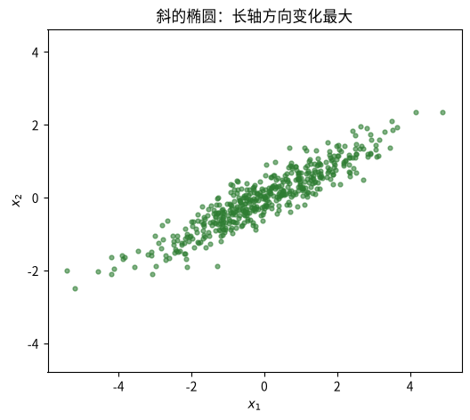
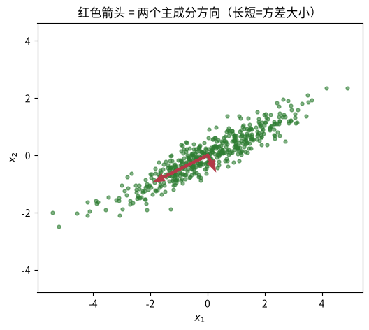
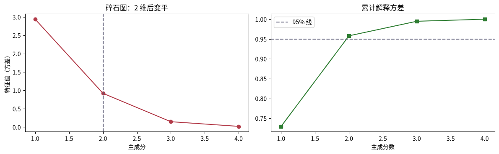
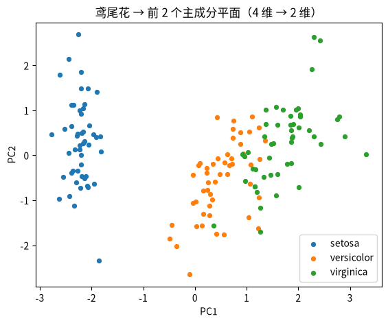

---
title: PCA 降维：找数据最「伸展」的方向
published: 2026-08-18
description: 机器学习课程第 12 课（系列终章）：PCA 主成分分析降维，含手写 PCA 四步、与 sklearn 对照验证、碎石图选维与练习测验。
tags: [机器学习, PCA, 降维, 无监督学习, 特征值分解]
category: 机器学习
draft: false
prevTitle: ""
prevSlug: ""
nextTitle: "K-Means 聚类"
nextSlug: "机器学习/0011-k均值聚类"
---

# PCA 降维：找数据最「伸展」的方向

这是机器学习系列课程笔记第 12 课，也是经典算法系列的最后一课。前置知识：课程 0011（无监督聚类）+ 线性代数基础。前面解决「分类/聚类」，PCA 解决另一类问题——**降维**：数据有很多特征（比如 30 维），很多维度高度相关、信息冗余。PCA 找出几个「最能代表数据变化」的新方向，把数据投影过去，用更少的维度保存大部分信息。这也是读论文时最常见的前置步骤。

## 一、知识点

### 直觉：方差最大的方向就是信息最多的方向

一坨数据沿哪个方向「伸展」得最长，那个方向的变化（方差）就最大，丢弃它损失的差异就最多。所以 PCA：

1. **找第一个主轴**：让投影后方差最大的那个方向（第一主成分 PC1）；
2. **找第二个主轴**：与 PC1 垂直、次大的方向（PC2）；
3. 以此类推，得到 d 个互相垂直、方差递减的方向。

### 三要素（无监督）

- **模型**：一组正交基（主成分方向）；数据 = 沿这些方向的投影系数。
- **策略**：最大化投影方差（等价于最小化投影后重构误差）。
- **算法**：中心化 → 算协方差矩阵 → 特征值分解（或对数据做 SVD）。特征值大的方向即主成分。

### 数学：就是特征值分解

中心化：

$$X_c = X - \mathrm{mean}(X)$$

协方差矩阵：

$$C = \frac{X_c^{\mathsf{T}} X_c}{N - 1}$$

特征值分解 $C\,v = \lambda\,v$：特征向量 $v$ 是主轴方向，特征值 $\lambda$ 是该轴上的方差。解释方差比：

$$\text{解释方差比}_i = \frac{\lambda_i}{\sum_j \lambda_j}$$

每个主成分「吃掉」总方差的比例。降维到 k 维 = 取前 k 个特征向量组成矩阵 $V_k$，投影 $Z = X_c V_k$。

### 三个必懂点

1. **用「解释方差比」决定保留几维**。把特征值按大小画「碎石图」：前几个陡、后面平。常取「累计解释方差 ≥ 80%/95%」对应的 k。以鸢尾花（4 特征）为例，前 2 个主成分就解释约 **96%** 方差——2 维图基本不丢信息。
2. **降维前必须标准化**。PCA 找「方差最大方向」，如果特征量纲不同（身高 180 vs 体重 70），大数值的特征会霸占第一主成分。先 `StandardScaler` 让每个特征方差为 1，PCA 才看「形状」而不是「量纲」。
3. **PCA 是线性变换，主轴互相垂直**。它找的是「直线方向」，适合线性结构。非线性结构（流形、弯曲）要用 t-SNE / UMAP 那类非线性降维。PCA 的另一面用途：去相关（各主成分互相独立）、可视化、压缩、去噪。

### 推荐阅读

> - **ISL 第 12.2 节（Principal Components Analysis）**——PCA 的几何直觉与矩阵代数。[statlearning.com](https://www.statlearning.com/)。
> - **李航《统计学习方法》第 16 章**——主成分分析的特征值分解视角（含奇异值分解版）。[豆瓣页面](https://book.douban.com/subject/33437381/)。

### 接下来

到这里，MISSION 里的经典算法主线（线性模型 → 决策树 → SVM → 贝叶斯 → 集成 → 聚类 → 降维）就全部走完了。做完练习记得回答：H1 里降维后分类准确率掉了吗？下一步你可以选：**① 用这些算法做一次完整建模实战**（数据→特征→建模→评估→调优）；**② 补高斯混合模型（GMM）/EM** 收尾无监督；**③ 回到深度学习进阶**。

## 二、动手实践

### 直觉：椭圆里的主方向

先造一坨「斜的椭圆」数据，PCA 的主轴一眼就能看出来——PC1 沿长轴、PC2 沿短轴。

```python
import numpy as np
import matplotlib.pyplot as plt

rng = np.random.default_rng(0)
base = rng.normal(size=(500, 2))
Xe = base @ np.array([[1.5, 0.6], [0.6, 0.6]])    # 旋转+拉伸 → 斜椭圆
Xe = Xe - Xe.mean(0)

plt.figure(figsize=(6, 5))
plt.scatter(Xe[:, 0], Xe[:, 1], s=12, alpha=0.6, color="#2e7d32")
plt.axis("equal"); plt.xlabel("$x_1$"); plt.ylabel("$x_2$")
plt.title("斜的椭圆：长轴方向变化最大")
plt.show()
```



*图：旋转+拉伸生成的斜椭圆。矩阵非对角元 0.6 代表两个变量正相关，使椭圆发生旋转；特征值差距大说明长短轴差异大、椭圆被强烈拉伸。*

### 手写 PCA：四步

中心化 → 协方差矩阵 → 特征值分解 → 取前 k 个特征向量投影。特征值 λ 就是该主轴上的方差。

```python
def pca_fit(X, k=2):
    """手写 PCA。返回 (Z投影, 特征值, 特征向量, 解释方差比)。"""
    Xc = X - X.mean(axis=0)                                # ① 中心化
    cov = (Xc.T @ Xc) / (len(X) - 1)                       # ② 协方差矩阵
    eigvals, eigvecs = np.linalg.eigh(cov)                 # ③ 特征值分解
    order = np.argsort(eigvals)[::-1]                      # 按特征值降序
    eigvals, eigvecs = eigvals[order], eigvecs[:, order]
    Z = Xc @ eigvecs[:, :k]                                # ④ 投影
    ratio = eigvals / eigvals.sum()                        # 解释方差比
    return Z, eigvals, eigvecs, ratio

Z, ev, evec, ratio = pca_fit(Xe, k=2)
print("特征值（=各主轴方差）：", np.round(ev, 3))
print("解释方差比：", np.round(ratio, 3), " 合计:", round(float(ratio.sum()), 3))

# 把主轴画上去（PC1 方向 = evec[:, 0]）
scale = np.sqrt(ev)                                        # 长度按方差开根
plt.figure(figsize=(6, 5))
plt.scatter(Xe[:, 0], Xe[:, 1], s=12, alpha=0.6, color="#2e7d32")
for i in range(2):
    plt.arrow(0, 0, evec[0, i] * scale[i], evec[1, i] * scale[i],
              color="#b23a48", lw=3, head_width=0.15)
plt.axis("equal"); plt.xlabel("$x_1$"); plt.ylabel("$x_2$")
plt.title("红色箭头 = 两个主成分方向（长短=方差大小）")
plt.show()
```



*图：两个红色箭头即 PC1/PC2 方向，长度按特征值开根缩放——长轴方向方差大。*

### 验证：手写 vs sklearn 完全一致

用鸢尾花（4 特征）验证——这是标准教材数据集，特征值、解释方差比、投影都应和 sklearn 一致（主轴可能差个正负号）。

```python
from sklearn.datasets import load_iris
from sklearn.preprocessing import StandardScaler
from sklearn.decomposition import PCA

iris = load_iris()
X = StandardScaler().fit_transform(iris.data)     # 注意：先标准化！
y = iris.target

Z_hand, ev_hand, evec_hand, ratio_hand = pca_fit(X, k=2)
pca = PCA(n_components=2).fit_transform(X)

print("手写解释方差比：", np.round(ratio_hand[:2], 3))
print("sklearn 解释方差比：", np.round(PCA().fit(X).explained_variance_ratio_[:2], 3))

# 符号对齐后比较投影
for i in range(2):
    if np.corrcoef(Z_hand[:, i], pca[:, i])[0, 1] < 0:
        Z_hand[:, i] *= -1
print("手写与 sklearn 投影一致：", np.allclose(Z_hand, pca))
```

### 碎石图：决定保留几维

把特征值从大到小画出来：前几个陡、后面平。累计解释方差 ≥ 80%（通常 2 维即可）就是保留维数。鸢尾花前 2 维解释约 96%。

```python
ev_all = PCA().fit(X).explained_variance_
cum = np.cumsum(PCA().fit(X).explained_variance_ratio_)

fig, axes = plt.subplots(1, 2, figsize=(12, 3.8))
axes[0].plot(range(1, 5), ev_all, "o-", color="#b23a48")
axes[0].axvline(2, ls="--", color="#5c5c75"); axes[0].set_title("碎石图：2 维后变平")
axes[0].set_xlabel("主成分"); axes[0].set_ylabel("特征值（方差）")
axes[1].plot(range(1, 5), cum, "s-", color="#2e7d32")
axes[1].axhline(0.95, ls="--", color="#5c5c75", label="95% 线")
axes[1].set_title("累计解释方差"); axes[1].set_xlabel("主成分数"); axes[1].legend()
plt.tight_layout(); plt.show()
```



*图：左图为碎石图（特征值递减，2 维后变平）；右图为累计解释方差曲线，2 维已超过 95% 线。*

### 降维后的 2D 可视化

把 4 维鸢尾花投到 PC1-PC2 平面，三类依然可分——说明 2 维确实保留了分类所需的信息。

```python
plt.figure(figsize=(6.5, 5))
for c, name in enumerate(iris.target_names):
    plt.scatter(pca[y == c, 0], pca[y == c, 1], s=18, label=name)
plt.xlabel("PC1"); plt.ylabel("PC2"); plt.legend()
plt.title("鸢尾花 → 前 2 个主成分平面（4 维 → 2 维）")
plt.show()
```



*图：4 维鸢尾花投影到前 2 个主成分平面后，三个品种依然可分。*

## 三、练习

### S1. 为什么方差最大的方向信息最多？

为什么「方差最大的方向」就是「信息最多的方向」？如果所有点挤在一根线上（一个特征 = 另一个特征的线性组合），数据其实是几维的？PCA 会给出什么特征值？

<details>
<summary>答案</summary>
<p>方差衡量样本离散程度，方差大样本区分度高，携带更多信息；样本全部落在一条直线，数据实际为 1 维；PCA 会得到一个非零特征值、一个等于 0 的特征值。</p>
</details>

### S2. 主成分为什么必须正交？

主成分必须互相正交，为什么？如果 PC2 和 PC1 有重叠成分，会出什么问题？

<details>
<summary>答案</summary>
<p>主成分正交保证各主成分互不相关，信息不重复；若不正交，主成分存在信息冗余，方差被重复统计，无法正确提取剩余方向的最大方差。</p>
</details>

### M1. 不同维度的累计解释方差

手写 `pca_fit` 的 k 参数：把鸢尾花降到 1 维、2 维、3 维，分别打印累计解释方差比。要解释 95% 的方差，最少需要几维？

<details>
<summary>答案</summary>
<p>解释方差比 = 特征值 / 特征值总和，累计解释方差比 = 前 k 个特征值 / 特征值总和。鸢尾花前 2 个主成分累计解释约 96%，所以最少需要 2 维即可解释 95% 的方差。</p>
</details>

### M2. 不标准化会发生什么？

不标准化直接对原始鸢尾花数据（sepal/petal 的厘米值）做 PCA，看第一主成分被哪个特征主导（检查 `evec[:, 0]` 的系数）。再对比标准化版，说明为什么量纲会霸占方差。

<details>
<summary>答案</summary>
<p>PCA 对特征尺度极度敏感；量纲大的特征会霸占方差，主导主成分——未标准化时第一主成分几乎由数值更大的花瓣特征决定。不同单位的特征做 PCA，必须先标准化。</p>
</details>

### H1. PCA 降维对分类的影响

用交叉验证对比「全 4 维」vs「PCA 2 维」在逻辑回归上的准确率。PCA 掉了多少？在真实场景里，你会为了什么目的接受这个损失？（可视化、去相关、降维加速、去噪）

<details>
<summary>答案</summary>
<p>PCA 降维会损失少量信息，带来轻微准确率下降；为了可视化、运算加速、消除特征相关性、抑制噪声，工程上可以接受少量损失。</p>
</details>

### H2. 面试题：PCA 和 SVD 的关系

面试题：PCA 和 SVD 的关系？为什么实际实现常用 SVD 而不是直接算协方差矩阵特征分解？（提示：数值稳定性、避免显式构造协方差）

<details>
<summary>答案</summary>
<p>中心化数据的 PCA 等价于对数据矩阵做 SVD，右奇异向量就是主成分；SVD 不需要显式计算 $X^TX$ 协方差矩阵，拥有更好的数值稳定性，因此工程实现优先使用 SVD。</p>
</details>

## 四、测验

### 测验 1

问题：PCA 找主成分的标准是？

选项：A. 误差最小化 / B. 信息熵最小 / C. 距离最近 / D. 投影方差最大

<details>
<summary>答案与解析</summary>
<p><strong>答案：D</strong>。最大化投影方差 = 最小化重构误差，两个角度等价。</p>
</details>

### 测验 2

问题：PCA 的核心计算是什么？

选项：A. 梯度下降 / B. 距离矩阵 / C. 贝叶斯公式 / D. 协方差矩阵特征值分解

<details>
<summary>答案与解析</summary>
<p><strong>答案：D</strong>。特征向量=主轴方向，特征值=该轴方差。</p>
</details>

### 测验 3

问题：降维前为什么必须先标准化？

选项：A. 加速收敛 / B. 减少样本 / C. 去除离群点 / D. 避免量纲霸占方差

<details>
<summary>答案与解析</summary>
<p><strong>答案：D</strong>。PCA 看方差，量纲大的特征会主导主成分方向。</p>
</details>

### 测验 4

问题：第 k+1 个主成分必须与前面主成分？

选项：A. 平行 / B. 同向 / C. 无关 / D. 正交

<details>
<summary>答案与解析</summary>
<p><strong>答案：D</strong>。主成分互相正交，才保证每个方向的信息不重复。</p>
</details>

## 五、小结

PCA 用「方差最大 = 信息最多」的直觉，把降维化归为协方差矩阵的特征值分解——特征向量给方向，特征值给该方向携带的信息量。它是无监督的，不看标签，却常为有监督任务服务（可视化、去相关、加速、去噪）。作为系列最后一课，它与前面所有算法的区别在于：不学映射、不分组，而是重新描述数据本身——这也为后续的深度学习进阶（更复杂的特征表示学习）埋下了伏笔。
| — | [课程目录](/my-blog/posts/机器学习/0001-机器学习全景与学习路线图/) | [下一课 →](/my-blog/posts/机器学习/0011-k均值聚类/) |
